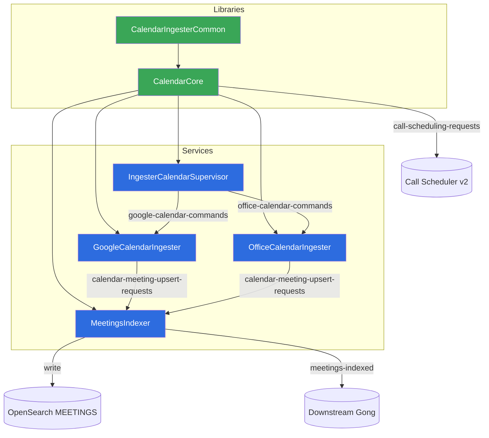

# 01 · Architecture & Modules

> [[_dashboard|← Team Hub]] · [[00 - Overview]] · next → [[02 - Data Flows]]

The calendar sub-system is the `Calendar/` sub-tree of the **`gong-ingestion`** Maven
aggregator (`com.honeyfy.ingestion:gong-ingestion`, parent `gong-parent-pom:17.main.200`).
The `Calendar/pom.xml` is itself an aggregator (`CalendarIngesterSystem`) with **6 modules**:
**4 deployable Spring Boot services** (each builds a container image) and **2 shared
libraries** (`container.image.skip=true`).

> The wider `gong-ingestion` repo also contains the **Mail** sub-system, **ProviderConnectivity**,
> and the shared `IngesterCommon` / `MeetingsIndexerCommon` libraries. This doc set covers the
> **Calendar** sub-system only.

## Deployable services

| Module | Image name | Type | Role |
|---|---|---|---|
| **IngesterCalendarSupervisor** | `ingestercalendarsupervisor` | `api-server` (internal) | The orchestration brain — scheduled sync fan-out, deletion/backfill, REST + troubleshooter API, command producers. |
| **GoogleCalendarIngester** | `googlecalendaringester` | `api-server` (internal) | Consumes `google-calendar-commands`; fetches events from the **Google Calendar API**. |
| **OfficeCalendarIngester** | `officecalendaringester` | `api-server` (internal) | Consumes `office-calendar-commands`; fetches events from **MS Graph / Office 365**. |
| **MeetingsIndexer** | `meetingsindexer` | `api-server` (internal) | Indexes meetings into the OpenSearch **MEETINGS** index; CRM & call-id re-association. |

All four are `publicFacing: false`, `locks: true`, `scheduledTasks: true`, owner
`ariel.bloch@gong.io`, Sentry team `mail-cal-ingestion`.

## Shared libraries

| Module | Role |
|---|---|
| **CalendarCore** | The functional core. Provider abstraction (Google/Office), event-import logic, meeting-upsert pipeline, CRM association, MongoDB DAOs, call-scheduling producer, history, purge/backfill, sync-status notifiers. |
| **CalendarIngesterCommon** | Shared Kafka contracts: `CalendarCommand` (`ImportCommand`, `BackfillMeetingsCommand`), `CalendarSyncStatusUpdate`, `UserContext`/`CompanyContext`, and the `CalendarIngesterKafkaConfig` producer template beans. |

## Module dependency graph



Arrows point in the direction of the **dependency / data flow**. Libraries never depend on
services.

## Deployment

- All 4 services deploy to the **GPE** environment via
  `com.honeyfy.webutil.deploy.AwsAutoDiscoveryRollingDeployment`.
- **Crossplane-managed** (`managedByCrossplane: true`), AWS-backed, rolling deploys.
- All 4 use **distributed locks** (`locks: true`) and run **scheduled tasks**
  (`scheduledTasks: true`).
- `routingPrefix: ""` on all four — no context path (relevant for local URLs).

## Where things live (repo layout)

```
gong-ingestion/
├── pom.xml                          # top aggregator (Calendar, Mail, ProviderConnectivity, …)
└── Calendar/
    ├── pom.xml                      # CalendarIngesterSystem aggregator: 6 modules
    ├── IngesterCalendarSupervisor/  # [service] orchestration brain
    ├── GoogleCalendarIngester/      # [service] Google Calendar fetcher
    ├── OfficeCalendarIngester/      # [service] Office 365 / MS Graph fetcher
    ├── MeetingsIndexer/             # [service] meetings → OpenSearch
    ├── CalendarCore/                # [lib] functional core
    └── CalendarIngesterCommon/      # [lib] Kafka contracts + producer config
```

`GongAppRole` values (used by wiring tests / app-descriptors): `IngesterCalendarSupervisor`,
`GoogleCalendarIngester`, `OfficeCalendarIngester`, `MeetingsIndexer`.
