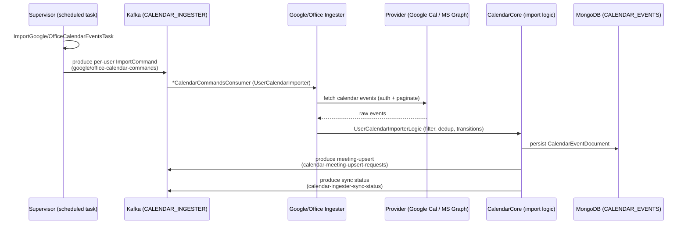
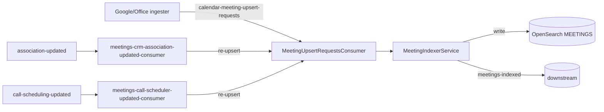
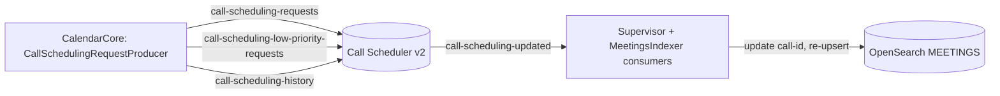
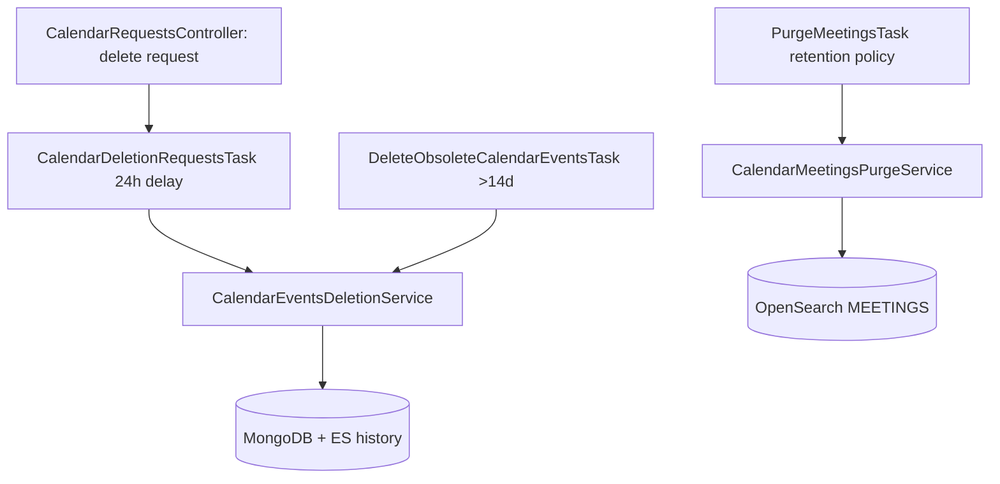

# 02 · Data Flows & Entry Points

> [[_dashboard|← Team Hub]] · [[01 - Architecture & Modules]] · next → [[03 - Services Reference]]

This is the most important page for understanding the system. It lists **every way data or
a request can enter Calendar Ingestion**, then shows the major flows as diagrams.

---

## 🔑 All system entry points

Calendar Ingestion has **three classes of entry point** (no S3 object-drop path, unlike
Telephony). Anything that triggers work in our services comes through one of these.

### 1. Scheduled / distributed tasks (time-driven — the primary path)

Run by `IngesterCalendarSupervisor` (`scheduledTasks: true`) via a
`DistributedScheduledTaskExecutor`. These are the heartbeat of the system — they periodically
**fan companies/users out** as import commands and do housekeeping:

| Task | Cadence (prod) | Triggers |
|---|---|---|
| `ImportGoogleCalendarEventsTask` | ~15 min | Enqueue Google import commands for all enabled companies |
| `ImportOfficeCalendarEventsTask` | ~15 min | Enqueue Office 365 import commands for all enabled companies |
| `UpdateAzureUsersTask` | hourly | Sync Azure AD users for Office 365 integrations |
| `CalendarDeletionRequestsTask` | ~15 min | Process delayed (24h) company meeting-deletion requests |
| `DeleteObsoleteCalendarEventsTask` | ~15 min | Delete events >14 days old from MongoDB + ES |
| `PurgeMeetingsTask` | daily | Purge meetings/history per workspace retention policy |
| `SimpleHeartbeatTask` | ~1 min | Liveness/heartbeat (present in every service) |

> Source of truth: `IngesterCalendarSupervisor/.../scheduledTasks/` and `ImportCalendarTasks`.
> Cadences are indicative — confirm against the scheduled-task config before relying on them.

### 2. Kafka consumers (event-driven)

| Consumer | Service | Topic consumed | Cluster | Triggers |
|---|---|---|---|---|
| `google-calendar-commands-consumer` (`GoogleCalendarCommandsConsumer`) | GoogleCalendarIngester | `google-calendar-commands` | CALENDAR_INGESTER | Import one user's Google calendar |
| `office-calendar-commands-consumer` (`OfficeCalendarCommandsConsumer`) | OfficeCalendarIngester | `office-calendar-commands` | CALENDAR_INGESTER | Import one user's Office 365 calendar |
| `MeetingUpsertRequestsConsumer` | MeetingsIndexer | `calendar-meeting-upsert-requests` | CALENDAR_INGESTER | Index/delete a meeting in OpenSearch |
| `meetings-crm-association-updated-consumer` | MeetingsIndexer | `association-updated` | ACTIVITY_CRM_ASSOCIATIONS | Re-enrich meeting CRM data, re-upsert |
| `meetings-call-scheduler-updated-consumer` | MeetingsIndexer | `call-scheduling-updated` | CALL_SCHEDULER_V2 | Update meeting call-id, re-upsert |
| `calendar-call-scheduling-updated-consumer` | IngesterCalendarSupervisor | `call-scheduling-updated` | CALL_SCHEDULER_V2 | React to scheduling updates |
| `CalendarSyncStatusConsumer` | (CalendarCore, in Supervisor) | `calendar-ingester-sync-status` | CALENDAR_INGESTER | Aggregate per-user/company sync status |

> **Producers** (where we emit events): the Supervisor and provider ingesters produce
> `google-calendar-commands` / `office-calendar-commands` (import fan-out),
> `calendar-meeting-upsert-requests` (the meeting hand-off to the indexer),
> `calendar-ingester-sync-status`, `call-scheduling-requests` /
> `call-scheduling-low-priority-requests` / `call-scheduling-history` (recording scheduling),
> `meetings-indexed` and `meetings-snowflake-backfill` (downstream / analytics).

### 3. REST / HTTP endpoints

Spring Boot `main` entry points (all `routingPrefix: ""`, no context path):

| Service | Main class |
|---|---|
| IngesterCalendarSupervisor | `…calendar.supervisor.config.IngesterCalendarSupervisorInitializer` |
| GoogleCalendarIngester | `…calendar.google.config.GoogleCalendarIngesterInitializer` |
| OfficeCalendarIngester | `…calendar.office.config.OfficeCalendarIngesterInitializer` |
| MeetingsIndexer | `…calendar.meetingsIndexer.config.MeetingsIndexerInitializer` |

Almost all functional + troubleshooter HTTP lives in **IngesterCalendarSupervisor**. The two
provider ingesters and MeetingsIndexer expose only a `HomeController` (redirects to Swagger).

Notable **functional** controllers (Supervisor):

- `CalendarRequestsController` / `v2.IcsCalendarRequestsController` — meeting deletion & backfill; produces `calendar-meeting-upsert-requests`
- `CalendarMirrorController` / `v2.IcsCalendarMirrorController` — invalidate mirror caches
- `AppUserMappingsController` / `v2.IcsAppUserMappingsController` — email → app-user mapping
- `AdminFallbackController` / `v2.IcsAdminFallbackController` — admin-fallback sync mode
- `MeetingBackfillTasksController` — create/delete backfill tasks (deprecated)

> **Troubleshooter** controllers (the `Troubleshooting*` classes, ~18 of them, under
> `/troubleshooting/**`) are a *protected* entry point — VPN + troubleshooter JWT cookie.
> See [[06 - Runbook & Troubleshooting]].

---

## Flow A — Scheduled import fan-out (the core path)

## Flow B — Meeting indexing + enrichment

## Flow C — Recording scheduling

## Flow D — Deletion / purge

## Kafka topic map (who reads / writes what)

| Topic | Supervisor | Google | Office | MeetingsIndexer |
|---|---|---|---|---|
| `google-calendar-commands` | W | R | | |
| `office-calendar-commands` | W | | R | |
| `calendar-meeting-upsert-requests` | W | W | W | R/W |
| `calendar-ingester-sync-status` | R/W | W | W | |
| `call-scheduling-requests` | W | W | W | |
| `call-scheduling-low-priority-requests` | W | W | W | |
| `call-scheduling-history` | W | W | W | W |
| `call-scheduling-updated` | R | | | R |
| `association-updated` | | | | R |
| `meetings-indexed` | W | | | W |
| `meetings-snowflake-backfill` | W | | | |
| `ingester-sync-status` (MAIL_INGESTER) | W | W | W | |

> Access (R/W) is taken from each module's `*.gong-app-descriptor.yaml`. Treat this table as
> the authoritative starting point, but confirm against the descriptor before relying on it for
> a change — topics are added/removed over time.
