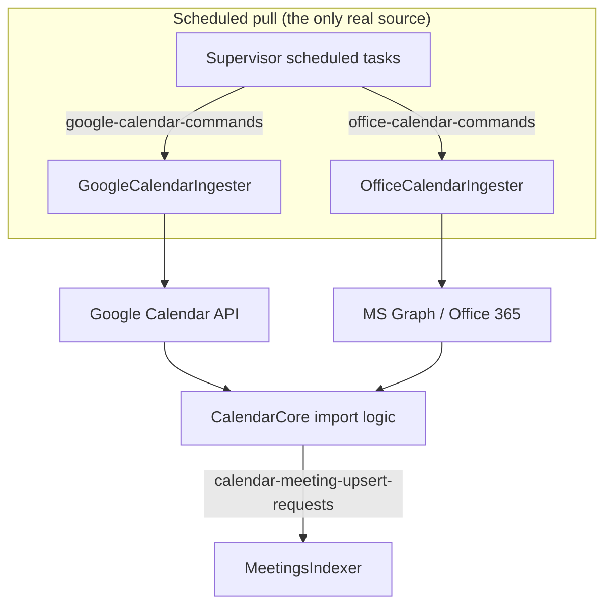

# 04 · Providers & Sources

> [[_dashboard|← Team Hub]] · [[03 - Services Reference]] · next → [[05 - Observability]]

Provider-specific integration logic lives in the **`CalendarCore`** library under
`CalendarCore/src/main/java/com/honeyfy/ingester/calendar/core/provider/`, behind a
`CalendarProvider` abstraction selected via a provider registry. Unlike Telephony's many
dialers, calendar has **two providers**, but each gets its **own deployable ingester** service.

## Supported providers

### Google Calendar (`GoogleCalendarIngester` + `core/provider/GoogleCalendarProvider`)

- **Auth:** Google service-account (`google.GongApp` secret) via `GoogleAppsAuthService` /
  `GoogleTokenService`; domain-wide delegation to read user calendars.
- **Fetch:** `GoogleCalendarProvider` calls the Google Calendar API, paginates events.
- **Command topic:** `google-calendar-commands` (consumed by `GoogleCalendarCommandsConsumer`).
- **Status notifier:** `GoogleCalendarSyncStatusUpdateNotifier`.

### Microsoft Office 365 / Outlook (`OfficeCalendarIngester` + `core/provider/OfficeCalendarProvider`)

- **Auth:** Azure AD / MS Graph via the `office365common` `Office365LegacyClientFactory`
  (`Office365UserClient` / `Office365CompanyAppClient`); tokens in Redis (`AzureUserDao`).
- **User sync:** `OfficeAzureUsersService` + the Supervisor's `UpdateAzureUsersTask` keep the
  Azure user list in sync with Gong users.
- **Fetch:** `OfficeCalendarProvider` calls MS Graph, adapts events into the common model.
- **Command topic:** `office-calendar-commands` (consumed by `OfficeCalendarCommandsConsumer`).
- **Status notifier:** `OfficeCalendarSyncStatusUpdateNotifier`.

> The provider abstraction (`CalendarProvider` + registry) means import/meeting logic in
> `CalendarCore` is provider-agnostic — re-check the `provider/` package before assuming
> behavior is provider-specific.

## The shared functional core (`CalendarCore`)

| Package | Role |
|---|---|
| `ingest` | Event import: `UserCalendarImporter`, `UserCalendarImporterLogic`, `AllEventsImportLogic`, `CallsEventsImportLogic`, `EventFilterService`, `EventTransitionResolver` |
| `meetings` | Meeting lifecycle: `CalendarMeetingsProcessor` (upsert pipeline), `CalendarMeetingsBackfillService`, `CalendarEventsDeletionService`, `CalendarMeetingsPurgeService` |
| `provider` | Provider abstraction + Google/Office providers, `OfficeAzureUsersService`, company integration preferences |
| `crm` | `CalendarCrmAssociationService` — associate meetings with CRM accounts/contacts |
| `producer` | `ProviderCompaniesImporter` — produce per-company/user import & backfill commands |
| `callScheduling` | `CallSchedulingRequestProducer` — produce recording-scheduling requests |
| `statusNotifier` | Sync-status consumer + per-provider notifiers (`calendar-ingester-sync-status`) |
| `mongo` | MongoDB DAOs: `CalendarEventsDao`, `CalendarMeetingsDao`, mirror DAOs, invalidation |
| `db` | Company settings, backfill/purge/deletedMeetings DAOs |
| `history` | Meeting-change audit trail (`CalendarEventHistoryProducer`) |
| `workspace` | `UserWorkspaceMapper` |
| `recruiting` | Recruiting event filtering |

## Ingestion modes

Both providers ingest **pull-only** (scheduled or on-demand sync), unlike Telephony which also
has push (webhook/Kafka) and S3-drop modes.

## Adding / changing a provider (high level)

1. Add a `CalendarProvider` implementation under `CalendarCore/.../provider/`.
2. Register it in the provider registry; add a command topic + consumer if it needs its own
   deployable ingester (as Google/Office each do).
3. Register credentials/config via **ProviderIntegrationManager** and add the secret to the
   relevant service descriptor.
4. Add `Troubleshooting*` endpoints in the Supervisor if support needs to inspect/replay it.
5. Add wiring-test coverage (declare new Feign deps in the module's `*.gong-app-descriptor.yaml`
   `applications:` block).

> Confirm the current pattern against the existing Google/Office providers before starting —
> this is a sketch, not a substitute for reading the code.
