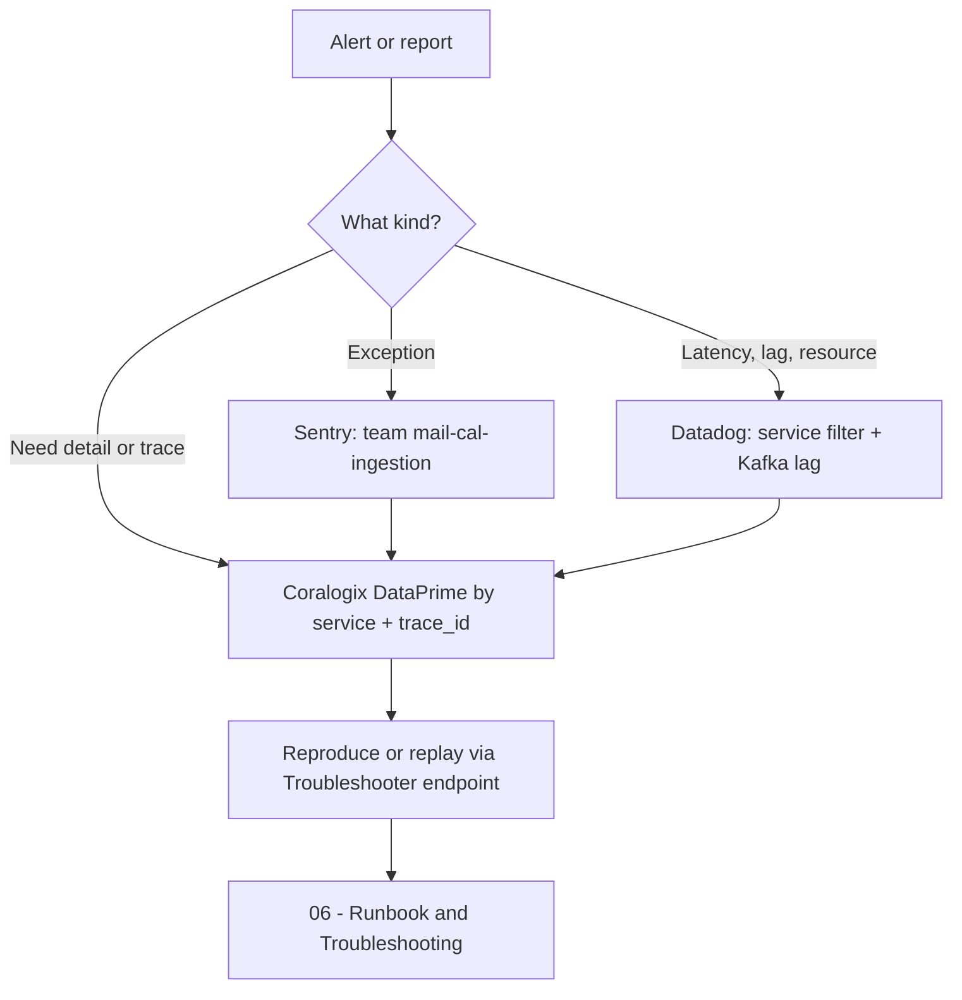

# 05 · Observability

> [[_dashboard|← Team Hub]] · [[04 - Providers & Sources]] · next → [[06 - Runbook & Troubleshooting]]

> ⚠️ **Honesty note:** Gong's observability tooling is accessed through MCP integrations and
> region-specific apps. The **link patterns and query filters below are correct**, but where a
> URL needs a specific dashboard/alert ID I've left a `<…>` placeholder rather than invent one.
> Paste the real IDs in the first time you open each — then this becomes a true one-click hub.

* **Datadog:**: https://app.datadoghq.com/dashboard/wz6-t44-s9n/calendar-ingester-system?fromUser=false&refresh_mode=sliding&from_ts=1782397040941&to_ts=1782400640941&live=true

## Service identifiers (use these everywhere)

Filter by the container-image names — these are the service identifiers in logs/metrics:

| Service | `service` / image name |
|---|---|
| IngesterCalendarSupervisor | `ingestercalendarsupervisor` |
| GoogleCalendarIngester | `googlecalendaringester` |
| OfficeCalendarIngester | `officecalendaringester` |
| MeetingsIndexer | `meetingsindexer` |

---

## 🌐 My remote dev env (`terry-collins-dev-env`)

The calendar services in my personal GPE dev env are reachable at
`<image>.modules.terry-collins-dev-env.c1-devex.ilc1.internal.gongio.net` (VPN required).
Swagger UI is at `https://<host>/swagger-ui/index.html`.

| Service                    | Remote host                                                                                  |
| -------------------------- | -------------------------------------------------------------------------------------------- |
| IngesterCalendarSupervisor | `ingestercalendarsupervisor.modules.terry-collins-dev-env.c1-devex.ilc1.internal.gongio.net` |
| GoogleCalendarIngester     | `googlecalendaringester.modules.terry-collins-dev-env.c1-devex.ilc1.internal.gongio.net`     |
| OfficeCalendarIngester     | `officecalendaringester.modules.terry-collins-dev-env.c1-devex.ilc1.internal.gongio.net`     |
| MeetingsIndexer            | `meetingsindexer.modules.terry-collins-dev-env.c1-devex.ilc1.internal.gongio.net`            |

> These mirror the Telephony hosts already captured in [[List of urls]]. Spin the subsystem up
> with `gong-module-run` (see [[Entrypoints Within the Calendar System]]); the supervisor is the
> one with most HTTP surface. Confirm a service is actually deployed to the env before relying on
> its host.

---

## 📜 Logs — Coralogix

Gong uses **Coralogix** for logs/traces (multi-region: `coralogix-us-01`, `us-02`, `eu-02`, `np`).
Query in **DataPrime**.

**Starter query — errors for a service (last 1h):**
```text
source logs
| filter $l.applicationname == 'ingestercalendarsupervisor'
| filter $m.severity == 'ERROR'
| limit 200
```

**Follow one company/user sync:** filter by `trace_id` or the `companyId` / `userId` in the
MDC, then correlate logs ↔ spans.

- Ask Claude: *"use the coralogix-debug-expert"* for guided investigations, or run a DataPrime
  query via the `observability:coralogix-logs` skill.
- Per-logger level changes at runtime: **Logs Manager** troubleshooter (`logs-manager-vip.prod.gongio.net`).

---

## 📈 Metrics — Datadog

Gong publishes metrics to **Datadog** (no APM/traces — traces are in Coralogix).

**Useful metric families** (filter by `service:<name>` and `g-cell`):

| Metric family | What it tells you |
|---|---|
| `com.honeyfy.*` | App/business metrics (import counts, meetings indexed, sync failures) |
| `feign.*` | Outbound calls to upstream (ProviderIntegrationManager, CrmMappings, AuroraController…) |
| `jvm.*` | Heap, GC, threads |
| `kubernetes.*` | Pods, restarts, CPU/mem, HPA scaling |
| Kafka consumer lag | Backlog on `*-calendar-commands` / `calendar-meeting-upsert-requests` — the #1 ingestion-health signal |

- Ask Claude: *"use the datadog-expert"* or the `observability:datadog` skill.
- **Dashboard:** `https://app.datadoghq.com/dashboard/<dashboard-id>` — *paste team dashboard id*
- **Kafka lag** is the key health metric — alert if consumer lag on the command topics or
  `calendar-meeting-upsert-requests` grows unbounded.

---

## 🚨 Alerts

### Sentry (errors / exceptions)

- **Team:** `mail-cal-ingestion` (set as `sentryTeam` in every service descriptor).
- Org: `https://gong-io.sentry.io/` → filter by team `mail-cal-ingestion`.
- Saved search: `https://gong-io.sentry.io/issues/?query=assigned%3A%23mail-cal-ingestion&statsPeriod=14d`
- Investigate an issue: ask Claude *"investigate this Sentry issue <url>"* → runs the
  `observability:sentry-investigation` workflow (Sentry → Coralogix correlation → code).
- ⚠️ This team also owns the **Mail** sub-system in the same repo — the Sentry team is shared.

### Datadog monitors

- Monitors: `https://app.datadoghq.com/monitors/manage?q=service%3A<service-name>`
- Recommended coverage (verify what already exists): consumer-lag on the command topics,
  error-rate, pod-restart/crashloop, provider-sync-failure rate (watch
  `calendar-ingester-sync-status` failures).

---

## 🔭 Quick triage flow



## TODO for the team (fill these in once)

- [x] Paste real **Datadog dashboard** URL(s) for the 4 services ✅ 2026-06-25
- [ ] Confirm the **Sentry** saved-search URL for `mail-cal-ingestion`
- [ ] List the **named Datadog monitors** that currently exist + their thresholds
- [ ] Confirm which **Coralogix region** our cells log to
