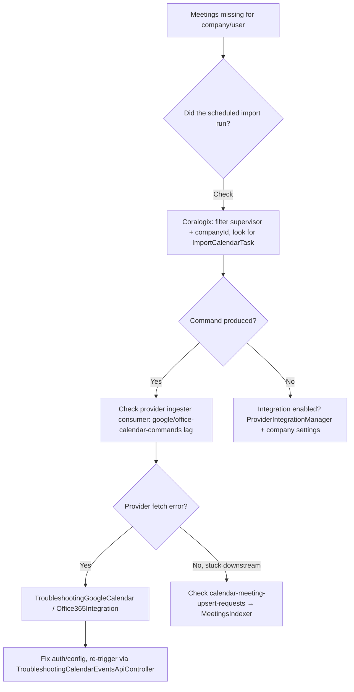

# 06 · Runbook & Troubleshooting

> [[_dashboard|← Team Hub]] · [[05 - Observability]] · next → [[07 - Onboarding Checklist]]

## Troubleshooter endpoints

The `Troubleshooting*` controllers in **IngesterCalendarSupervisor** (~18 of them, under
`/troubleshooting/**`) are **internal, production-active** REST endpoints for support/engineering
to inspect and re-drive calendar ingestion. They are **not** tenant-facing.

**Auth (two layers):**
1. **Network** — support-team VPN ingress (`*.prod.gongio.net` / `*.internal.gongio.net` is not
   internet-exposed).
2. **Application** — Okta-issued JWT troubleshooter cookie, validated by a filter on the
   `/troubleshooting/**` path group.

### Notable troubleshooters (Supervisor `rest/` package)

| Troubleshooter | Use for |
|---|---|
| `TroubleshootingCalendarEventsApiController` | Trigger a manual import for a company/user |
| `TroubleshootingCalendarKafkaMessages` | Send import/backfill Kafka commands manually |
| `TroubleshootingCalendarMeetingsBackfill` | Trigger meeting backfill tasks |
| `TroubleshootingEventHistoryController` | Query/delete calendar event history (ES) |
| `TroubleshootingCalendarEventsDeletion` / `…EventsHash` / `…EventsUtils` | Inspect deletion logic, event hashes, raw events |
| `TroubleshootingEventCacheController` / `…AllEventsCacheController` | Invalidate event caches |
| `TroubleshootingAllEventsMeetings` | Inspect all-events meetings; fix missing affiliation data |
| `TroubleshootingGoogleCalendar` | Debug Google Calendar API integration |
| `TroubleshootingOffice365Integration` / `TroubleshootingAzureUserService` | Debug Office 365 / Azure user sync |
| `TroubleshootingIcsApiClient` | Debug ICS API client |
| `TroubleshootingRecruitingGoogleSync` / `…RawCalendarEvents` / `…EventsDeletion` | Recruiting calendar paths |
| `TroubleshootingEnableAdminFallback` | Debug admin-fallback sync mode |

> Discover the live, exact paths via the Supervisor's Swagger UI at
> `https://ingestercalendarsupervisor.modules.terry-collins-dev-env.c1-devex.ilc1.internal.gongio.net/swagger-ui/index.html`
> (VPN + cookie), or locally — see [[Entrypoints Within the Calendar System]].

---

## Common incident playbooks

### 1. "Meetings from a company aren't showing up"

### 2. Consumer lag climbing

1. Datadog → Kafka consumer lag for the service ([[05 - Observability]]).
   - command topics (`google-calendar-commands` / `office-calendar-commands`) → provider ingester
   - `calendar-meeting-upsert-requests` → MeetingsIndexer
2. Coralogix → are records erroring or just slow? Filter by consumer class.
3. Check upstream Feign deps (`feign.*`) — ProviderIntegrationManager / CrmMappings slow?
4. If poison message: identify offset in logs. Note: the provider command consumers do **not**
   reprocess on error (events regenerate on the next scheduled sync), so a single bad command is
   usually self-healing — confirm before manual intervention.

### 3. CRM association missing on meetings

- `meetings-crm-association-updated-consumer` re-enriches on `association-updated`.
- Persistent gaps: inspect `CalendarCrmAssociationService` path; check CrmMappings / CRM data.

### 4. Recording not scheduled for a meeting

- Calendar produces `call-scheduling-requests`; the call-id comes back on `call-scheduling-updated`
  and is applied by `meetings-call-scheduler-updated-consumer`.
- Check the call-scheduling producer in `CalendarCore/callScheduling` and the downstream Call
  Scheduler v2 health.

### 5. Need to purge / delete meetings

- Company-requested deletion → `CalendarRequestsController` → `CalendarDeletionRequestsTask`
  (24h delay) → `CalendarEventsDeletionService`.
- Obsolete (>14d) cleanup → `DeleteObsoleteCalendarEventsTask`.
- Retention purge → `PurgeMeetingsTask` → `CalendarMeetingsPurgeService`.

---

## Operational facts to keep handy

- **Deploy:** GPE, Crossplane-managed rolling deploys (`AwsAutoDiscoveryRollingDeployment`).
- **Locks:** all 4 services use distributed locks (`locks: true`) and scheduled tasks.
- **Primary trigger** is the Supervisor's scheduled fan-out (every ~15 min), *not* push events.
- **Runtime log levels:** adjustable via Logs Manager (no redeploy) — see [[05 - Observability]].
- **Owner:** ariel.bloch@gong.io · **Sentry team:** `mail-cal-ingestion` (shared with Mail).
- **Stores:** MongoDB `CALENDAR_EVENTS` (raw events) · OpenSearch `MEETINGS` (indexed meetings)
  + `CALENDAR_EVENTS_HISTORY` (audit).
