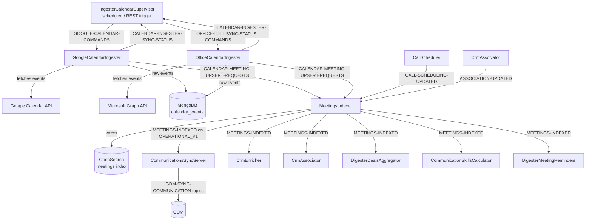

---
tags:
- gong
- ingestion
- calendar
- kafka
- architecture
created: 2026-06-25
---

# Calendar Ingestion Architecture

> **TL;DR** All calendar ingestion lives in `gong-ingestion`. A supervisor schedules syncs, provider-specific workers fetch events, a shared indexer writes to OpenSearch, and a fan-out of 6+ downstream consumers reacts to `MEETINGS-INDEXED`. Team: **mail-cal-ingestion** (ariel.bloch@gong.io).

See [[Ingestion (`gong-ingestion`) - Entry Points]] for every REST and scheduled entry point in detail.

---

## Services

All modules are independent `api-server` pods in the `gong-ingestion` repo, except `CommunicationsSyncServer` which lives in `gong-communications-publisher`.

| Module | Repo | Role |
|---|---|---|
| `IngesterCalendarSupervisor` | `gong-ingestion` | Orchestrator — schedules sync runs, dispatches Kafka commands, monitors status |
| `GoogleCalendarIngester` | `gong-ingestion` | Fetches events from Google Calendar API |
| `OfficeCalendarIngester` | `gong-ingestion` | Fetches events from Microsoft 365 API |
| `MeetingsIndexer` | `gong-ingestion` | Converts raw events → indexed meeting records in OpenSearch |
| `CommunicationsSyncServer` | `gong-communications-publisher` | Publishes `MEETINGS-INDEXED` events into the GDM |

---

## End-to-End Flow

---

## Key Classes

| Class | Module | Role |
|---|---|---|
| `GoogleCalendarProvider` | GoogleCalendarIngester | Google Calendar API client; implements `CalendarProvider` |
| `OfficeCalendarProvider` | OfficeCalendarIngester | Microsoft Graph API client; implements `CalendarProvider` |
| `AllEventsImportLogic` | CalendarCore | Core decision logic — filter, cancel, or upsert an event |
| `CalendarMeetingsProcessor` | CalendarCore | Converts `CalendarEventDocument` → `MeetingIndexDto`; publishes `MeetingUpsertFromCalendarIngest` |
| `CalendarEventHistoryProducer` | CalendarCore | Writes event state changes to `calendar-events-history` OpenSearch index |
| `CalendarSyncStatusConsumer` | CalendarCore | Consumes `CALENDAR-INGESTER-SYNC-STATUS`; updates sync health via `IngestionSyncStatusService` |
| `DeleteObsoleteCalendarEventsTask` | IngesterCalendarSupervisor | Scheduled cleanup of stale calendar events |
| `MeetingUpsertFromCalendarIngest` | honeyfy shared lib | Kafka DTO carrying `MeetingIndexDto` from workers to `MeetingsIndexer` |
| `AbstractCalendarEventHandler` | CommunicationsSyncServer | Handles `MEETINGS-INDEXED`; publishes to GDM topics |

---

## Kafka Topics

All topics belong to the `CALENDAR_INGESTER` topic group.

| Topic | Producer | Consumer |
|---|---|---|
| `GOOGLE-CALENDAR-COMMANDS` | IngesterCalendarSupervisor | GoogleCalendarIngester |
| `OFFICE-CALENDAR-COMMANDS` | IngesterCalendarSupervisor | OfficeCalendarIngester |
| `CALENDAR-MEETING-UPSERT-REQUESTS` | GoogleCalendarIngester, OfficeCalendarIngester, IngesterCalendarSupervisor | MeetingsIndexer |
| `CALENDAR-INGESTER-SYNC-STATUS` | GoogleCalendarIngester, OfficeCalendarIngester | IngesterCalendarSupervisor |
| `MEETINGS-INDEXED` (on `OPERATIONAL_V1`) | MeetingsIndexer, IngesterCalendarSupervisor | CommunicationsSyncServer, CrmEnricher, CrmAssociator, DigesterDealsAggregator, CommunicationSkillsCalculator, DigesterMeetingReminders |
| `CALL-SCHEDULING-UPDATED` (on `CALL_SCHEDULER_V2`) | CallScheduler | MeetingsIndexer |
| `ASSOCIATION-UPDATED` (on `ACTIVITY_CRM_ASSOCIATIONS`) | CrmAssociator | MeetingsIndexer |

---

## Storage

| Store | Resource | Used By | Purpose |
|---|---|---|---|
| MongoDB (`gong-dev`) | `calendar_events` | Workers, Supervisor, MeetingsIndexer | Raw intermediate event store |
| OpenSearch | `meetings` | MeetingsIndexer, CommunicationsSyncServer | Canonical queryable meeting records |
| OpenSearch | `calendar-events-history` | Workers, Supervisor | Audit log of every event state change |
| Postgres (`ingester` DB) | Various | All ingester modules | Connectivity state, sync scheduling metadata |
| Postgres (`honeyfy` DB) | Various | All ingester modules | Core platform data (users, companies) |
| Redis (`INGESTER_REDIS`) | Key-value cache | Workers, Supervisor | Ingestion state caching |

---

## Key Design Notes

- **Provider isolation is clean** — Google and Office each have dedicated modules consuming their own command topic. A new provider follows the same pattern.
- **`CALENDAR-MEETING-UPSERT-REQUESTS` is the central handoff** — decouples provider ingestion from meeting indexing. MeetingsIndexer is provider-agnostic.
- **`MEETINGS-INDEXED` is the fan-out event** — 6+ consumers react to it; any new calendar-adjacent feature likely subscribes here.
- **MongoDB is intermediate, OpenSearch is canonical** — raw events land in Mongo first; `meetings` OpenSearch index is the queryable source of truth.
- **One team owns end-to-end** — `mail-cal-ingestion` team owns everything from supervisor through indexer.

---

## See also

- [[Ingestion (`gong-ingestion`) - Entry Points]]
