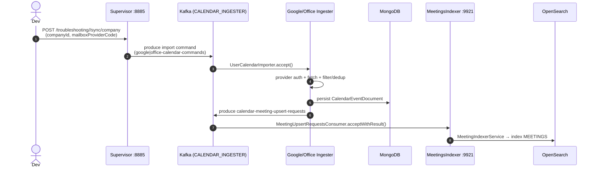

# System Diagram — entrypoints & data flow

> [[_dashboard|← Team Hub]] · [[02 - Data Flows]] · [[Entrypoints Within the Calendar System]] · [[Swagger Trigger Runbook]]

One view of how work enters Calendar Ingestion and flows through to the OpenSearch sink.
Topics, services, and stores are taken from the verified app-descriptors and code map.

## Master flow

```mermaid
flowchart TB
    %% ---- Entry points ----
    subgraph EP["① Entry points"]
        direction TB
        SCHED["⏱ Scheduled tasks<br/>(Supervisor)<br/>ImportGoogle/OfficeCalendarEventsTask ~15m"]
        REST["🌐 REST / Swagger<br/>(Supervisor :8885)<br/>/troubleshooting//sync/* · /calendar-import/*"]
        EXT["📡 Upstream Kafka<br/>association-updated · call-scheduling-updated"]
    end

    %% ---- Supervisor ----
    subgraph SUP["IngesterCalendarSupervisor :8885"]
        IMP["ProviderCompaniesImporter<br/>sendImportCommand()"]
    end

    SCHED --> IMP
    REST --> IMP

    %% ---- Command topics ----
    GC(["google-calendar-commands"]):::topic
    OC(["office-calendar-commands"]):::topic
    IMP -->|GOOGLE_APPS| GC
    IMP -->|OFFICE365| OC

    %% ---- Provider ingesters ----
    subgraph PROV["Provider ingesters (Kafka-driven)"]
        direction TB
        G["GoogleCalendarIngester :8887<br/>GoogleCalendarCommandsConsumer<br/>→ UserCalendarImporter.accept()"]
        O["OfficeCalendarIngester :8886<br/>OfficeCalendarCommandsConsumer<br/>→ UserCalendarImporter.accept()"]
    end
    GC --> G
    OC --> O

    PAPI["Provider API<br/>Google Calendar / MS Graph"]
    G <-->|auth + fetch events| PAPI
    O <-->|auth + fetch events| PAPI

    MONGO[("MongoDB<br/>CALENDAR_EVENTS<br/>CalendarEventDocument")]:::store
    G -->|filter / dedup / persist| MONGO
    O -->|filter / dedup / persist| MONGO

    %% ---- Hand-off to indexer ----
    UPS(["calendar-meeting-upsert-requests"]):::topic
    G --> UPS
    O --> UPS

    %% ---- Indexer sink ----
    subgraph IDX["MeetingsIndexer :9921"]
        MUC["MeetingUpsertRequestsConsumer<br/>acceptWithResult()"]
        MIS["MeetingIndexerService<br/>indexMeetingsByOrder()"]
        MUC --> MIS
    end
    UPS --> MUC
    EXT -->|re-enrich / re-upsert| MUC

    ES[("OpenSearch<br/>MEETINGS index")]:::store
    MIS -->|index / delete| ES
    OUTI(["meetings-indexed"]):::topic
    MIS --> OUTI

    classDef topic fill:#fde68a,stroke:#b45309,color:#000;
    classDef store fill:#bfdbfe,stroke:#1e40af,color:#000;
```

## How to read it

- **① Entry points** — the only three ways work starts: scheduled fan-out (primary), REST/Swagger
  (manual/troubleshooting), and upstream Kafka events that trigger re-indexing.
- **Command topics** (`google|office-calendar-commands`) are the fan-out boundary: the Supervisor
  decides *who* to import; the provider ingesters do the *actual fetch* one user/company at a time.
- **`calendar-meeting-upsert-requests`** is the single hand-off into the indexer. Anything that needs a
  meeting (re-)indexed produces to it — provider ingesters and the re-enrichment consumers alike.
- **Stores**: MongoDB holds raw `CalendarEventDocument`s; OpenSearch `MEETINGS` is the queryable sink.

## Trigger sequence (for debugging)

> Breakpoint targets for each numbered step are in [[Swagger Trigger Runbook]]; the full topic
> read/write matrix is in [[02 - Data Flows]].
