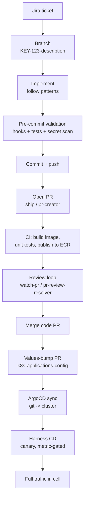

---
tags:
- gong
- workflow
- process
- git
- ci-cd
- deployment
- runbook
created: 2026-06-24
---

# Idea to Production — Gong Eng Workflow

The end-to-end path a change takes from a Jira ticket to running in front of
customers. Two halves with different owners: the **dev/PR half** (you drive it,
the `ship`/`pr-creator` skills automate it) and the **deploy half** (ArgoCD +
Harness drive it, mostly automatically).

> **TL;DR** — Work is keyed to a Jira ticket from the start; the branch name is
> *derived* from it and the key is mandatory. Pre-commit hooks + Java test
> validation gate the commit. PR → CI → review → merge ships the **code**, but
> not the **deploy**: a separate values-bump PR drives **ArgoCD** sync, and
> **Harness** canary-promotes on metrics. A pod isn't "deployed" until ArgoCD
> synced it *and* Harness promoted it.

---

## The flow at a glance



---

## 1. Start from a Jira ticket

Everything is keyed to a Jira ticket from the very start — the branch name is
derived from it. The `jira-analyzer` workflow parses the ticket, detects
technology keywords, and routes to the right skills/patterns before any code is
written.

## 2. Branch — the ticket key is mandatory

This is the hard rule. Branch names **must** match:

```
^(?:(?:revert)[\s:-]+)?[A-Z]+-\d+(?:-[a-z0-9]+)*$
```

- Ticket key **UPPERCASE** (`SECTKT`, `DPE`, `INFRA`)
- Description **lowercase**, **hyphens only** (no `_`, no `/`)

| Valid | Invalid |
|---|---|
| `SECTKT-21712-fix-vulnerable-glibc` | `feature/my-branch` (no key) |
| `DPE-3588-upgrade-postgres-16-8` | `INFRA-123_fix_timeout` (underscores) |
| `CORE-456` | `dpe-3588-...` (lowercase key) |

The `pr-creator` skill refuses to invent a name — it fetches the ticket and
slugifies the summary, then confirms before creating the branch.

## 3. Implement

Follow existing patterns (skills auto-load Feign/Kafka/RDS/etc. guidance).
Check **[Technical Ownership](https://gongio.atlassian.net/wiki/spaces/EN/pages/4209180678/)**
before cross-service changes.

## 4. Pre-commit validation (enforced)

- **Pre-commit hooks must run** — no `--no-verify`. TruffleHog scans for secrets.
- For Java changes, the `java-implementation-validator` runs affected unit
  **and** wiring tests before "done" is allowed. Wiring tests validate the
  `gong-app-descriptor.yaml` topology (a common Feign-client failure mode).
- Conventional commit messages. No force-push to `main` / `master` / `develop`.

## 5. PR

The `ship` skill does it in one step: commit → push → open PR → move the Jira
ticket to **Code Review**. Useful flags:

| Flag | Effect |
|---|---|
| `-i` / `implement` | Read ticket, implement, then ship |
| `--draft` | Open PR as draft |
| `-nj` | Create a new GONG ticket first |
| `-sj` | Skip the Jira transition |
| `--cb` | Use the branch name from the Jira Development panel |

Frontend repos (`gong-web-ui`, `gong-design-system`, React/TS) route to the
dedicated `frontend-general:pr-creator` skill instead.

## 6. CI + review loop

- CI (Jenkins / GitHub Actions) builds the Docker image, runs unit tests, and
  publishes `<service>:<tag>` to ECR.
- Review feedback: `pr-review-resolver` (work through threads one fix at a time)
  and `watch-pr` (background loop polling every 5 min, auto-stops on merge).

## 7. Merge → deploy (two tools, two concerns)

Merging the code PR does **not** deploy it. Deployment is GitOps:

| Step | Tool | What happens |
|---|---|---|
| Image published | CI | `<service>:<tag>` lands in ECR |
| **Values bump PR** | you / automation | A *second* PR in `k8s-applications-config` bumps the image tag in per-cell `values-*.yaml` |
| **Sync** | **ArgoCD** | Continuously reconciles git ↔ cluster; applies the manifest, creates a Rollout |
| **Promote** | **Harness CD** | Canary: monitors metric-analysis-run, promotes or aborts automatically |

> [!important]
> A pod is **not "deployed" until ArgoCD synced it AND Harness promoted it**
> (for services that use canaries). Some workloads skip Harness and go
> full-traffic on ArgoCD sync alone.

**Per-cell targeting:** a per-cell values file is the targeting mechanism
(e.g. `values-global-<cell>-c1-app.yaml`). Rollouts happen cell-by-cell, not
globally at once.

## 8. Confirm it's working in production

- **Harness canary gating** is the first automated confirmation — metric
  analysis decides promote vs. abort.
- Verify cell-by-cell as the rollout progresses.
- Observability: **Datadog** (metrics/logs), **Coralogix** (logs/traces),
  **Sentry** (errors) — dedicated skills/agents exist for each.
- The `verify` skill manually confirms a change behaves as intended.
- `update-release-notes-ai4dev` logs merged PRs to a changelog.

---

## Enforced vs. convention

| Enforced (can't bypass) | Convention / tooling-assisted |
|---|---|
| Branch-name regex (ticket key) | `ship` one-shot flow |
| Pre-commit hooks + secret scan | PR description quality |
| Java test validation before "done" | Jira status transitions |
| GitOps values-PR + ArgoCD sync | Release notes |
| Harness canary gates | |

---

## Caveats

- The deploy-half details come from the DevOps **concept** docs
  (`deployment-flow`), which note "the mechanics evolve; this concept is
  stable." Exact values-file naming and which services skip Harness vary by
  team/area.
- The release-notes git-trailer emission from `ship` is documented as
  **planned, not yet implemented**.

---

## See also

- [[Maven Version Sync (Boost)]]
- [[Comms Capture Maven Modules]]
- [[Local Dev - Prod Data Import Fix]]
