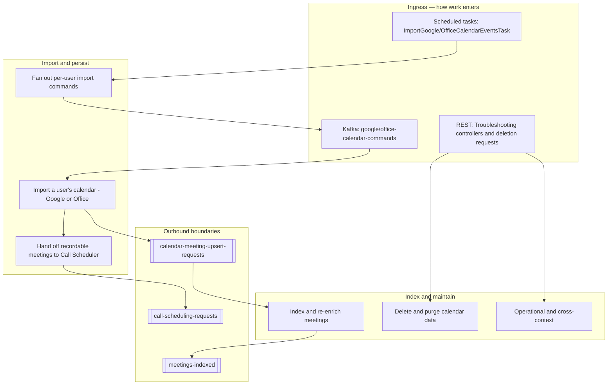
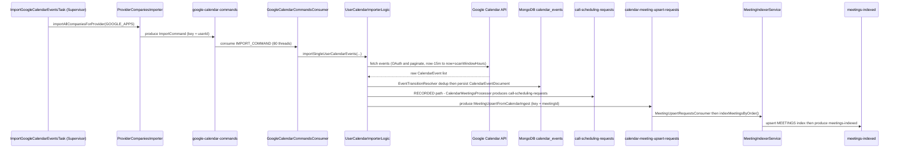

# 08 · Use Cases

> [[_dashboard|← Team Hub]] · [[00 - Overview]] · [[02 - Data Flows]] · [[03 - Services Reference]]

The **use cases** of the Calendar Ingestion sub-system — each written the DDD way: an **actor**
pursues a **goal** by issuing a **command** (a scheduled task, a `CalendarCommand`, or a Kafka
event), the command is carried by a **service** and **Kafka topic**, and on success it transitions
a domain object (a `CalendarEventDocument`, a meeting in the OpenSearch **MEETINGS** index, or a
`call-scheduling-requests` hand-off) and emits a **follow-on event**.

> **Vocabulary note.** Calendar Ingestion does **not** have a dedicated Ubiquitous Language page yet.
> Every bold term below is drawn from the existing [[02 - Data Flows]], [[00 - Overview]],
> [[01 - Architecture & Modules]], [[03 - Services Reference]],
> [[Entrypoints Within the Calendar System]] and
> [[Google Import Flow — Debugger Walkthrough]] docs — it is a real service, class, task, topic,
> command type, or entity named there. Nothing here is invented. Treat this as the *behavioural*
> view (what the system does and why); [[02 - Data Flows]] is the *plumbing* (which topic, which
> consumer) and [[03 - Services Reference]] is the *per-service* view.

---

## How to read a use case

Every use case is stated in one canonical sentence:

> **[Actor]** wants to **[goal]**, so it issues **[command / process]** — carried by
> **[service + topic]** — which transitions **[the domain object]** and emits **[follow-on event]**.

The three organizing axes of this domain, all from the docs:

| Part | The DDD role | The central axis |
|---|---|---|
| **`CalendarCommand` type** (`IMPORT_COMMAND`, `BACKFILL_MEETINGS_COMMAND`, `DELETE_MEETINGS_COMMAND`) | The **dispatch key** — *why* the ingester woke up. Routed in `UserCalendarImporter.accept(...)`. | The organizing axis of the fetch phase. |
| **Import path** (`CallsEventsImportLogic` = RECORDED vs `AllEventsImportLogic` = ALL_EVENTS) | The **branch selector** — chosen per user by `userContext` / `companyContext`. RECORDED events become calls. | Decides whether a meeting produces `call-scheduling-requests`. |
| **`EventTransitionResolver` outcome** (NEW / UPDATED / UNCHANGED / DELETED) | The **per-event lifecycle verb** — computed by comparing fetched events against MongoDB state. | Every imported event ends in exactly one transition. |

---

## The sub-system's use cases at a glance

Use cases are grouped by the real lifecycle verbs the sub-system has: **fan out**, **import**,
**schedule recording**, **index**, **delete/purge**, and **operate**. Within the import verb, the
`CalendarCommand` type and the import path (RECORDED vs ALL_EVENTS) distinguish the variants.

---

## Group A — Fan out import work *(decide who to sync)*

The Supervisor's scheduled tasks are the heartbeat. They enumerate enabled companies/users and
**produce one per-user command** per eligible user, keyed by `userId` so a single user is never
processed concurrently.

### UC-A1 · Fan out Google import commands

> **`ImportGoogleCalendarEventsTask`** (a scheduled task in **`ImportCalendarTasks`**, ~15 min in
> prod) wants every Google-enabled user synced, so it calls
> **`ProviderCompaniesImporter#importAllCompaniesForProvider(GOOGLE_APPS)`**, which fans companies
> out (10 threads) and produces an **`ImportCommand`** per user onto **`google-calendar-commands`**
> (cluster `CALENDAR_INGESTER`, key = `userId`).

- **Command payload:** `ImportCommand` (from `CalendarIngesterCommon`) — `companyId`, `userId`,
  `userEmail`, `userContext` (`shouldRecord`, `shouldImportNonRecordedMeetings`,
  `shouldScanCalendarForInterviews`), `companyContext` (`RECORDED_ONLY` vs `ALL_EVENTS`,
  `isCrmIntegrationEnabled`), `scanWindowHours`, `cycleId`.
- **Housekeeping first:** pending **deletion requests** are dispatched (`DELETE_MEETINGS_COMMAND`)
  before imports in each company cycle.

### UC-A2 · Fan out Office 365 import commands

> **`ImportOfficeCalendarEventsTask`** does the same for Office 365, producing `ImportCommand`s onto
> **`office-calendar-commands`** — the Office twin of UC-A1, consumed by a different deployable
> because the provider SDK/auth (Azure AD / MS Graph) is entirely different.

- **Actor:** same `ProviderCompaniesImporter` fan-out, `MailboxProviderCode` = Office.

### UC-A3 · Force a single-company import on demand

> An operator wants one company synced without waiting for the timer, so they hit
> **`TroubleshootingCalendarEventsApiController`** on the Supervisor, which drives the same
> `ProviderCompaniesImporter` path for that company — or crafts a raw command via
> **`TroubleshootingCalendarKafkaMessages`** straight onto the command topics.

- Protected entry point (VPN + troubleshooter JWT). See [[Entrypoints Within the Calendar System]].

---

## Group B — Import a user's calendar *(fetch, dedup, persist)*

The provider ingesters consume per-user commands and turn them into provider API calls. All real
logic lives in **`CalendarCore`** (`UserCalendarImporter` → `UserCalendarImporterLogic` →
`EventsImportLogicBase`), shared by both providers.

### UC-B1 · Import one user's Google calendar

> **`GoogleCalendarCommandsConsumer`** (extends `UserCalendarImporter`, ~80 threads) consumes an
> `IMPORT_COMMAND` off **`google-calendar-commands`** and calls
> **`UserCalendarImporterLogic#importSingleUserCalendarEvents(...)`**, which fetches events from the
> **Google Calendar API** (OAuth + paginate) over the `now-15m … now+scanWindowHours` window, then
> hands them to **`EventsImportLogicBase#importEvents`** to dedup and persist.

- **Provider wiring:** `GoogleCalendarProvider` + `GoogleAppsAuthService` / `GoogleTokenService`.
- **Transition:** `EventTransitionResolver` classifies each event NEW / UPDATED / UNCHANGED /
  DELETED, then persists a `CalendarEventDocument` to the MongoDB `calendar_events` collection (plus
  the `all_calendar_events` mirror) and logs to the `CALENDAR_EVENTS_HISTORY` OpenSearch index.
- **No error reprocessing:** a failed command is regenerated on the next scheduled sync.

### UC-B2 · Import one user's Office 365 calendar

> **`OfficeCalendarCommandsConsumer`** consumes off **`office-calendar-commands`** and runs the same
> `UserCalendarImporterLogic` path, fetching from **MS Graph / Office 365** via
> `OfficeCalendarProvider` + `OfficeAzureUsersService` (and the `office365common`
> `Office365LegacyClientFactory` / `AzureUserDao`).

- Same `CalendarCore` core as UC-B1 — only the provider fetch/auth differs.

### UC-B3 · Choose the import path (RECORDED vs ALL_EVENTS)

> Inside `importSingleUserCalendarEvents`, the importer branches: if
> **`userContext.shouldRecord`** (or `shouldScanCalendarForInterviews`) it runs
> **`CallsEventsImportLogic`** (the RECORDED path — meetings that become calls); if
> **`companyContext.calendarEventsImport == ALL_EVENTS`** and `shouldImportNonRecordedMeetings` it
> also runs **`AllEventsImportLogic`** (non-recorded meetings). Both can run for the same user.

- This branch is *the* reason a meeting does or does not reach Call Scheduler (see Group C).

---

## Group C — Hand off recordable meetings to Call Scheduler *(the recording boundary)*

### UC-C1 · Produce a call-scheduling request

> On the RECORDED path, **`CalendarMeetingsProcessor#processMeeting(..., CALL)`** converts a
> `CalendarEventDocument` into a `MeetingIndexDto`, annotates CRM associations, and — for
> `CallsEventsImportLogic` — produces a request onto **`call-scheduling-requests`** (with
> lower-priority and history variants `call-scheduling-low-priority-requests` /
> `call-scheduling-history`) to **Call Scheduler v2**.

- **This is one of the two bounded-context boundaries.** Once the request is on
  `call-scheduling-requests`, recording scheduling belongs to Call Scheduler v2 (see
  [[Subsystems/Call Scheduling/04 - Use Cases|Call Scheduling use cases]], UC-A1).
- **Return path:** Calendar Ingestion later consumes `call-scheduling-updated` to stamp the
  resulting call-id back onto the meeting (UC-D3).

---

## Group D — Index & re-enrich meetings *(the OpenSearch sink)*

**MeetingsIndexer** owns the OpenSearch **MEETINGS** index. Every write funnels through
`MeetingUpsertRequestsConsumer` → `MeetingIndexerService.indexMeetingsByOrder()`.

### UC-D1 · Index (or delete) a meeting

> The provider ingesters produce a **`MeetingUpsertFromCalendarIngest`** (wrapping a
> `MeetingIndexDto`) onto **`calendar-meeting-upsert-requests`** (key = `meetingId`);
> **`MeetingUpsertRequestsConsumer`** consumes it and `MeetingIndexerService.indexMeetingsByOrder()`
> upserts to the **MEETINGS** index — or deletes when **`toDelete == true`** (e.g. no CRM match) —
> then emits **`meetings-indexed`**.

- **This is the other bounded-context boundary.** `meetings-indexed` is where downstream Gong
  (search, CRM, forecasting) takes over.

### UC-D2 · Re-enrich a meeting when CRM associations change

> **`meetings-crm-association-updated-consumer`** consumes **`association-updated`** (cluster
> `ACTIVITY_CRM_ASSOCIATIONS`), re-enriches the meeting's invitee CRM data, and re-upserts via
> `calendar-meeting-upsert-requests`.

### UC-D3 · Stamp the scheduled call-id onto a meeting

> **`meetings-call-scheduler-updated-consumer`** consumes **`call-scheduling-updated`** (cluster
> `CALL_SCHEDULER_V2`), sets the scheduled call-id on the meeting, and re-upserts — closing the loop
> opened by UC-C1.

---

## Group E — Delete & purge calendar data *(retention & offboarding)*

| Use case | Trigger | What happens |
|---|---|---|
| **UC-E1 · Process a company deletion request** | `CalendarRequestsController` records a request → `CalendarDeletionRequestsTask` (24h delay) | `CalendarEventsDeletionService` removes the company's calendar events from MongoDB + ES history. |
| **UC-E2 · Delete obsolete events** | `DeleteObsoleteCalendarEventsTask` (~15 min) | Delete events >14 days old from MongoDB + ES. |
| **UC-E3 · Purge meetings by retention policy** | `PurgeMeetingsTask` (daily) | `CalendarMeetingsPurgeService` purges meetings/history per workspace retention policy from the MEETINGS index. |

- The `DELETE_MEETINGS_COMMAND` variant (dispatched in the fan-out) also drives per-user deletion
  through `AllEventsImportLogic.importEvents(session, false, emptyList())` — the empty list triggers
  deletion of all the user's meetings.

---

## Group F — Operational & cross-context use cases

These keep the sub-system healthy and its user/auth data fresh; a new hire will meet them quickly.

| Use case | Trigger | What happens |
|---|---|---|
| **UC-F1 · Sync Azure AD users** | `UpdateAzureUsersTask` (hourly) | Refresh Azure AD users (`AzureUserDao`) so Office 365 imports resolve users. |
| **UC-F2 · Aggregate sync status** | `CalendarSyncStatusConsumer` on `calendar-ingester-sync-status` | Roll up per-user/company sync status; ingesters produce it during import. |
| **UC-F3 · React to scheduling updates (Supervisor)** | `calendar-call-scheduling-updated-consumer` on `call-scheduling-updated` | Supervisor reacts to Call Scheduler updates. |
| **UC-F4 · Backfill meetings** | `BackfillMeetingsCommand` (via troubleshooter) → `calendarMeetingsBackfillService.backfillMeetingsForUser(...)` | Re-import a user's meetings out of band. Also `meetings-snowflake-backfill` for analytics. |
| **UC-F5 · Heartbeat** | `SimpleHeartbeatTask` (~1 min) | Liveness proof; the first local-debug smoke test. |

---

## Worked example — one Google import, end to end

Follow a single user through the whole sub-system (UC-A1 → UC-B1 → UC-C1 → UC-D1), based on
[[Google Import Flow — Debugger Walkthrough]]. Naming each element as it fires:

**The same sentence template, filled in:** *The **`ImportGoogleCalendarEventsTask`** wants every
Google user synced, so it issues an **`ImportCommand`** — carried by
**`GoogleCalendarCommandsConsumer`** off **`google-calendar-commands`** — which persists a
**`CalendarEventDocument`** and, on the RECORDED path, hands off to **`call-scheduling-requests`**
and **`calendar-meeting-upsert-requests`**, ending at the **MEETINGS** index and
**`meetings-indexed`**.*

---

## Use-case → code map (jump table)

| Use case | Command / entry point | Carried by | Outbound event / topic |
|---|---|---|---|
| UC-A1 Google fan-out | `ProviderCompaniesImporter#importAllCompaniesForProvider(GOOGLE_APPS)` | `ImportGoogleCalendarEventsTask` (Supervisor) | `google-calendar-commands` |
| UC-A2 Office fan-out | `ProviderCompaniesImporter#importAllCompaniesForProvider` (Office) | `ImportOfficeCalendarEventsTask` | `office-calendar-commands` |
| UC-A3 force one company | `TroubleshootingCalendarEventsApiController` / `TroubleshootingCalendarKafkaMessages` | Supervisor REST | `google/office-calendar-commands` |
| UC-B1 import Google user | `UserCalendarImporterLogic#importSingleUserCalendarEvents` | `GoogleCalendarCommandsConsumer` | MongoDB `calendar_events` |
| UC-B2 import Office user | same logic (MS Graph fetch) | `OfficeCalendarCommandsConsumer` | MongoDB `calendar_events` |
| UC-B3 choose import path | `CallsEventsImportLogic` vs `AllEventsImportLogic` | `userContext` / `companyContext` | (branch) |
| UC-C1 produce scheduling request | `CalendarMeetingsProcessor#processMeeting(..., CALL)` | `CalendarCore` producer | `call-scheduling-requests` (+ low-priority / history) |
| UC-D1 index/delete meeting | `MeetingIndexerService.indexMeetingsByOrder()` | `MeetingUpsertRequestsConsumer` | `meetings-indexed` |
| UC-D2 re-enrich CRM | re-upsert path | `meetings-crm-association-updated-consumer` (`association-updated`) | `calendar-meeting-upsert-requests` |
| UC-D3 stamp call-id | re-upsert path | `meetings-call-scheduler-updated-consumer` (`call-scheduling-updated`) | `calendar-meeting-upsert-requests` |
| UC-E1 company deletion | `CalendarEventsDeletionService` | `CalendarDeletionRequestsTask` (24h) | MongoDB + ES |
| UC-E2 obsolete events | delete >14d | `DeleteObsoleteCalendarEventsTask` | MongoDB + ES |
| UC-E3 retention purge | `CalendarMeetingsPurgeService` | `PurgeMeetingsTask` (daily) | MEETINGS index |
| UC-F1 Azure users | `AzureUserDao` refresh | `UpdateAzureUsersTask` (hourly) | — |
| UC-F2 sync status | aggregate | `CalendarSyncStatusConsumer` | `calendar-ingester-sync-status` |
| UC-F4 backfill | `calendarMeetingsBackfillService.backfillMeetingsForUser(...)` | `BackfillMeetingsCommand` | `meetings-snowflake-backfill` |

---

## See also

- [[02 - Data Flows]] — every entry point, the flow diagrams, and the Kafka topic map
- [[00 - Overview]] — the mental model in prose (the one-paragraph pipeline)
- [[03 - Services Reference]] — per-service infra, topics, and "which service do I touch?"
- [[Google Import Flow — Debugger Walkthrough]] — the worked example as breakpoints, step by step
- [[07 - Onboarding Checklist]] — put these use cases into practice locally
