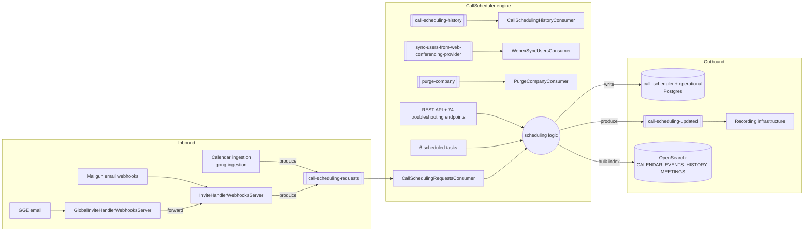

# 02 · Entry Points — Inbound & Outbound

> [[_dashboard|← Team Hub]] · [[00 - Overview]] · [[01 - Services & Modules]] · next → [[03 - Ubiquitous Language]]

Every way data **enters** and **leaves** the `gong-call-schedulers` system, grounded in code.
Every `file:line` below was verified against the mounted repo — trust these over the repo
`CLAUDE.md`, whose line numbers, cluster count, and endpoint totals are stale (see the
[[#Corrections to the repo CLAUDE.md|corrections]] at the bottom).

> [!info] Two deployables, one library, one monitor
> The system ships **two containers** — `CallScheduler` (the engine, private, **GPE**) and
> `InviteHandlerWebhooksServer` (public webhook receiver, **GPE**) — plus a third public receiver
> `GlobalInviteHandlerWebhooksServer` (**GGE**, a GGE→GPE bridge). `CallSchedulingCommon` is a shared
> library; `CallSchedulerMonitor` is a non-deployable dashboard generator. See [[01 - Services & Modules]].

---

## 🗺️ The shape in one picture

---

# INBOUND

## Cluster & schema at a glance

| | |
|---|---|
| **Postgres schema owned** | `call_scheduler` (`CREATE SCHEMA` in `schema/call_scheduler/db/migration/V20220830_0941__new_schema_call_scheduler.sql`) |
| **Cross-schema access** | `operational` (read/write), `recording_consent`, `recruiting`, `data_capture` (per app-descriptor `dataSources.postgres`) |
| **Kafka clusters (THREE, not one)** | `CALL_SCHEDULER_V2` (requests, low-priority, history, updated), `DATA_CAPTURE` (webex sync-users), `OPERATIONAL_V1` (purge-company); `APP_USER` = WRITE only |
| **OpenSearch indices** | `CALENDAR_EVENTS_HISTORY`, `MEETINGS`, `AUDITS` (per descriptor `elasticsearch`) |
| **Redis** | `GONG_PROD`, `CONSENT_REDIS`, `CIRCUIT_BREAKERS` |

---

## 1 · REST controllers

### Real API controllers (implement gong-clients contracts)

Both are `@RestController` with **no class-level `@RequestMapping`** and no method-level HTTP
annotations — the verbs/paths are inherited from interfaces in **`gong-clients`** (not in this repo,
so the exact `POST /scheduled-calls/...` paths can't be confirmed here). Request-body types are local.

| Controller | Implements | Key methods (`file:line`) | Request body |
|---|---|---|---|
| **`ScheduledCallsActionsController`** | `CallSchedulerApi` | `CallScheduler/.../rest/api/ScheduledCallsActionsController.java:25`; `scheduleNewCallManually:93`, `cancelScheduledCallByOwner:42`, `cancelScheduledRecurringCallByOwner:51`, `restoreCancelledCallByOwner:63`, `cancelScheduledCallByConsentEmail:83`, `cancelScheduledCallsByCompanyAndProvider:106`, `cancelScheduledInternalMeetingsCallsRecordings:116`, `changeScheduledCallsPrivacyByOwner:125` | `ManualSchedulingCallDetails` (`:95`), `List<Identifier.Descriptor>` (`:108`); others query-param |
| **`CancelBlacklistedCallsController`** | `CancelBlacklistedCallsApi` | `CallScheduler/.../rest/api/CancelBlacklistedCallsController.java:9`; `cancelBlacklistedCalls:18` | none (`long companyId`) |

### Troubleshooting controllers

**19 controller files · 74 endpoints** in the (misspelled) package `rest/toubleshooting/`. Almost
all are query-param driven; only 3 take a `@RequestBody`, all in
`TroubleshootingCallSchedulingRequestsConsumer` (`sendEventJson:44`, `sendEventJsonLowPriority:51` →
`CallSchedulingRequest`; `sendEventRawMessage:58` → `String`) — these **re-inject** events into the
request topics, the fastest way to drive the engine by hand.

> [!tip] Heaviest troubleshooting surfaces (endpoint counts)
> `TroubleshootingGoToMeetingIntegration` (17) · `TroubleshootingWebEx` (11) · `TroubleshootingRecurringEmailScheduling` (8) · `TroubleshootingCompanyInviteHandlerName` (6) · `TroubleshootingGoToMeetingSyncTasks` / `TroubleshootingGlobalInviteHandlersSummaryEmailSender` (5 each). Discover live paths via the Swagger UI (see [[05 - Onboarding Checklist]]).

## 2 · Mailgun webhook endpoints (`IncomingMailgunController`)

Public entry for calendar invites arriving as **email** (out-of-band from calendar sync). All `POST`,
all `@ResponseStatus(OK)`. `InviteHandlerWebhooksServer/.../controllers/IncomingMailgunController.java:42`.
Generic paths route through `getGenericFlowHandler`; `tenant-*` paths through `getTenantFlowHandler`.

| Path | Handler method (`:line`) | Flow (creation mechanism) |
|---|---|---|
| `/incoming-email/calendar-sync/mime` | `handleMailgunIncomingSyncEmail:75` | calendar-sync (`CALENDAR_SYNC_EMAIL`) |
| `/incoming-email/opt-in-invite/mime` | `handleMailgunIncomingOptInEmail:92` | opt-in (`OPT_IN_EMAIL`) |
| `/incoming-email/coordinator-invite/mime` | `handleMailgunIncomingCoordinatorEmail:107` | coordinator (`COORDINATOR_EMAIL`) |
| `/incoming-email/tenant-calendar-sync/mime` | `…SyncEmailWithTenant:123` | calendar-sync / tenant |
| `/incoming-email/tenant-calendar-sync-eu/mime` | `…SyncEmailForEUWithTenant:139` | calendar-sync / tenant / EU |
| `/incoming-email/tenant-opt-in-invite/mime` | `…OptInEmailWithTenant:154` | opt-in / tenant |
| `/incoming-email/tenant-opt-in-invite-eu/mime` | `…OptInEmailForEUWithTenant:178` | opt-in / tenant / EU |
| `/incoming-email/tenant-opt-in-invite-eu-test/mime` | `logRawRequest:194` (`@RequestBody String:197`) | TEST — logs only, no handler |
| `/incoming-email/tenant-coordinator-invite/mime` | `…CoordinatorEmailWithTenant:219` | coordinator / tenant |
| `/incoming-email/tenant-coordinator-invite-eu/mime` | `…CoordinatorEmailForEUWithTenant:235` | coordinator / tenant / EU |

**GGE bridge** — `GlobalInviteHandlerWebhooksController` (`GlobalInviteHandlerWebhooksServer/.../controllers/GlobalInviteHandlerWebhooksController.java:33`,
`@RestController`) exposes a **single wildcard router** `handleIncomingAssistantEmail`
(`@PostMapping:50`) matching `/incoming-email/*/mime` and `/troubleshooting/incoming-email/**`. It is
**not** flow-specific: it reads the invite-handler name from the `recipient`, resolves the target cell
via `InviteHandlerRoutingService.getRoutingInfo:74`, and forwards the raw request to the right GPE cell
via `RequestForwarder.forwardRequest:86`.

> [!warning] Mailgun signature validation
> Inbound emails are authenticated by `MailGunSignatureValidator` (`CallSchedulingCommon/.../mailreader/MailGunSignatureValidator.java`). MIME bodies are persisted to the `gong-transient-data` S3 bucket (descriptor `cloudStorage`).

## 3 · Kafka consumers (all wired **programmatically** — no `@KafkaListener`)

Consumers are wired in static `Beans` `@Configuration` classes via `configureSingle` /
`configureMultipleByTenant`. Grepping for `@KafkaListener` finds nothing — chase the `Beans` class.
All live in `CallScheduler/.../kafka/consumer/`.

| Descriptor consumer | Class · wiring `file:line` | Cluster | Payload / key | Concurrency · batch · errors |
|---|---|---|---|---|
| `call-scheduling-requests-consumer` | `CallSchedulingRequestsConsumer.java:262` (bean), `configureSingle:286` | `CALL_SCHEDULER_V2` | `CallSchedulingRequest` / `String` iCal id | 50 · retries 3, session 120s, maxPoll 180m, `onlyPersistErrors` (`:291-295`) |
| `call-scheduling-low-priority-requests-consumer` | `CallSchedulingRequestsConsumer.java:270` (2nd bean), `configureSingle:286` | `CALL_SCHEDULER_V2` | `CallSchedulingRequest` / `String` | 10 · same block |
| `call-scheduling-history-consumer` | `CallSchedulingHistoryConsumer.java:83` (bean), `configureMultipleByTenant:94` | `CALL_SCHEDULER_V2` | `GroupedGongEvents<CalendarEventHistoryItem>` / `Long` | **batch 100 (`:32`) / 30s (`:33`)**, concurrency 15 |
| `call-scheduler-webex-sync-users-consumer` | `CallSchedulerWebexSyncUsersConsumer.java:58` (bean), `configureSingle:61` | **`DATA_CAPTURE`** | `SyncUsersFromProviderEvent` / `Long` | 4 · `onlyPersistErrors`, maxPoll 30m (`:69-70`) |
| `call-scheduler-purge-company-consumer` | `CallSchedulerPurgeCompanyConsumer.java:60` (bean), `configureSingle:62` | **`OPERATIONAL_V1`** | `PurgeCompany` / `String` | 1 · retries 2, `persistErrorsWithReprocessing` (`:69-70`) |

Topic constant → literal (from the `KafkaInfra` dependency): `CALL_SCHEDULING_REQUESTS`=`call-scheduling-requests`,
`…_LOW_PRIORITY_REQUESTS`=`call-scheduling-low-priority-requests`, `…_HISTORY`=`call-scheduling-history`,
`SYNC_USERS_FROM_WEB_CONFERENCING_PROVIDER`=`sync-users-from-web-conferencing-provider`, `PURGE_COMPANY`=`purge-company`.

## 4 · Scheduled tasks (`DistributedScheduledTaskExecutor` — no `@Scheduled`)

No Spring `@Scheduled`. Tasks are programmatic `ScheduledTask` beans run by a DB-coordinated
`DistributedScheduledTaskExecutor` (hub: `CallScheduler/.../config/ScheduledTasks.java:14`, executor bean `:33`).
Only `CallScheduler` sets `scheduledTasks: true`. Cron literals come from `ScheduleTasksCommon/CronSchedules`.

| Task | Bean `file:line` | Work | Cron |
|---|---|---|---|
| webex-import-users | `scheduledtasks/WebExIntegrationBeans.java:29` | `webExMatchUsersTask::syncUsersForAllCompanies` | `DAILY_AT_2AM` |
| webex-refresh-tokens | `WebExIntegrationBeans.java:35` | `webexRefreshTokenService.refreshToken` | `EVERY_5_MINUTES_0` |
| zoom-import-meetings | `scheduledtasks/ZoomIntegrationBeans.java:24` | `zoomInSyncService::syncAllUpcomingMeetings` | `EVERY_15_MINUTES_3` |
| delete-updated-calendar-events | `scheduledtasks/DeleteUpdatedCalendarEventsScheduledTask.java:40` | `updatedCalendarEventDao.deleteUpdatedCalendarEvents` | prod `TWICE_A_DAY_2` |
| recurring-events-call-scheduler | `scheduledtasks/RecurringEventsCallScheduledTask.java:61` | `recurringEventService.processRecurringEventBatches` | prod `EVERY_2_HOURS` |
| send-global-invite-handlers-summary-emails | `scheduledtasks/GlobalInviteHandlerSummaryEmailScheduledTask.java:24` | `globalInviteHandlersSummaryEmailsSender::sendSummaryEmails` | `DAILY_AT_4PM` |

## 5 · SQS / distributed-task executors

**None.** No `GongTask`, `SqsGongTaskExecutor`, `SingleQueueTaskSubmitter`, or `SQSAccessor` anywhere in
main source. The only distributed async mechanism is the DB-coordinated scheduled-task executor above.

---

# OUTBOUND

## 6 · Kafka producers

| Producer · `file:line` | Topic (literal) | Cluster | Message / key |
|---|---|---|---|
| `CallSchedulingRequestProducer` — `InviteHandlerWebhooksServer/.../inviteemail/CallSchedulingRequestProducer.java:45` | `call-scheduling-requests` | `CALL_SCHEDULER_V2` | `CallSchedulingRequest` / `String` iCal id |
| `CallSchedulingHistoryProducer` — `CallSchedulingCommon/.../kafka/CallSchedulingHistoryProducer.java:239` | `call-scheduling-history` | `CALL_SCHEDULER_V2` | `CalendarEventHistoryItem` / no explicit key |
| `CallSchedulingUpdatedProducer` — `CallScheduler/.../kafka/producer/CallSchedulingUpdatedProducer.java:262` | `call-scheduling-updated` | `CALL_SCHEDULER_V2` | `CallSchedulingUpdated` (+ `CallSchedulingCalendarEventUpdated`, `ManualCallEventUpdated`) / `Long` callId; max request 20MB |

> [!note] `call-scheduling-updated` is the domain's **downstream hand-off** — the boundary where call
> scheduling ends and recording infrastructure begins. `CallSchedulingUpdatedProducerDao` is a DB **reader**
> despite the name.

## 7 · Database writes

Flyway migrations at `schema/call_scheduler/db/migration/`.

**Owned schema `call_scheduler`:**

| DAO · `file:line` | Table | Key write methods | SQL |
|---|---|---|---|
| `ScheduledCallsDao` — `CallScheduler/.../dao/ScheduledCallsDao.java:10` | `scheduled_calls` | `addScheduleCall:20` (UPSERT) | `sql/ScheduledCalls/UpsertScheduledCalls.sql` |
| `CalendarRecurringEventsDao` — `CallScheduler/.../dao/CalendarRecurringEventsDao.java:19` | `calendar_recurring_event` (+ office map) | `markCalendarRecurringEventAsCancelled:31`, `…AsRestored:42`, `upsertIcalAndRecurringIdOfficeMapEvent:61`, `upsertRecurringIdsRule:70` | `sql/CalendarRecurringEventsDao/` |
| `UpdatedCalendarEventDao` — `CallSchedulingCommon/.../common/UpdatedCalendarEventDao.java:15` | `updated_calendar_event` | `upsertUpdatedCalendarEvent:23`, `deleteUpdatedCalendarEvents:31` | `CallSchedulingCommon/.../sql/calendar/` |

**Cross-schema `operational`:**

| DAO · `file:line` | Table | Key write methods |
|---|---|---|
| `UpdateCallDao` — `CallScheduler/.../dao/UpdateCallDao.java:14` | `call` | `removeEmailInvitee:64`, `makeCallOptIn:73`, `updateCallWorkspace:86`, cancellation UPDATE-RETURNING (`:21/:29/:36/:44/:50`) |
| `CallDataDao` — `CallSchedulingCommon/.../common/CallDataDao.java:27` | `call` and related | `insertToCallAndGetResult:159`, `removeProviderForAllCompanies:203`, `cancelScheduledCallsByCallProvider:211` |
| `RecurringEventsDao` — `CallSchedulingCommon/.../recurring/RecurringEventsDao.java:38` | recurrent-event tables | `upsertEvent:127`, `insertEventHistory:153`, `cancelRecurringEvent:211`, `markMainEventAsCancelled:372`, `updateRecurringEventOnInactiveOwner:468` |

> [!warning] Two distinct calendar keys — don't conflate
> `scheduled_calls` / `updated_calendar_event` are keyed by **`enhanced_ical_id`**; `calendar_recurring_event`
> is keyed by **`ical_uid`**. See [[03 - Ubiquitous Language]].

## 8 · OpenSearch / Elasticsearch writes

Writer/MetaClient classes are **gong-clients library** classes, wired and invoked here:

- Write path: `CallScheduler/.../kafka/consumer/CallSchedulingHistoryConsumer.java:66` →
  `writer.submitBulk(companyId, events)` (field `CalendarEventsHistoryWriter:36`) → bulk-index
  `CalendarEventHistoryItem` into **`CALENDAR_EVENTS_HISTORY`**.
- Wiring: `CallScheduler/.../config/CallSchedulerConfig.java` — `MeetingsIndexMetaClient.Beans:92`,
  `CalendarEventsHistoryWriter.Beans:102`, `CalendarEventsHistoryIndexMetaClient.Beans:103`.
- `MEETINGS` and `AUDITS` are declared READ/WRITE in the descriptor; the concrete write for those
  goes through gong-clients writers (not a repo-local `IndexWriter`).

## 9 · Outbound service calls

- **Feign: confirmed NONE** — `@FeignClient` count is 0. This system **exposes** REST APIs (implements
  gong-clients contracts) rather than calling Feign clients. The `applications:` block in the descriptor
  lists services it may talk to via injected clients (e.g. `IngesterCalendarSupervisor`, `RecorderApiServer`,
  `ProviderIntegrationManagerApiServer`).
- **AWS Secrets Manager** via `GongSecretsService` (provider creds, Mailgun keys) — wired in
  `CallSchedulerConfig.java` / `InviteHandlerWebhooksConfig.java:49,117`.
- **Conferencing provider APIs** (gong-clients services): `webExService.createMeeting`
  (`TroubleshootingWebEx.java:106`), `zoomService.createReoccurringMeetingWithoutTime`
  (`TroubleshootingScheduleZoomMeeting.java:74`), `ZoomSyncService.java:149`, GoToMeeting integration beans.
- **Mailgun / email send**: `ThymeLeafEmailSender` / `InviteHandlerEmailSender`, summary senders in
  `CallScheduler/.../summaryemails/`. SMTP transport lives in the gong-clients `SendMail` library.

---

## Corrections to the repo `CLAUDE.md`

The repo's `CLAUDE.md` predates the current code. Verified corrections:

| CLAUDE.md says | Reality (verified) |
|---|---|
| One Kafka cluster `CALL_SCHEDULER_V2` | **Three** consumed clusters: `CALL_SCHEDULER_V2`, `DATA_CAPTURE`, `OPERATIONAL_V1` |
| `CallSchedulingRequestsConsumer:120`, `PurgeCompanyConsumer:18`, `SchedulingCallService:85`, etc. | Stale line numbers throughout — use the lines in this doc |
| "23 troubleshooting endpoints" | **19 files · 74 endpoints** |
| Implies `@KafkaListener` / `@Scheduled` / SQS | None exist — all async wiring is **programmatic** |

## See also

- [[00 - Overview]] — the mental model in prose
- [[01 - Services & Modules]] — per-module reference
- [[03 - Ubiquitous Language]] — the domain vocabulary behind these types
- [[Subsystems/Call Scheduling/Canvas/Call Scheduling - Data Flow.canvas|Data-flow canvas]] — the 10,000-ft view
- [[Subsystems/Calendar Ingestion/02 - Data Flows]] — where `call-scheduling-requests` is produced
