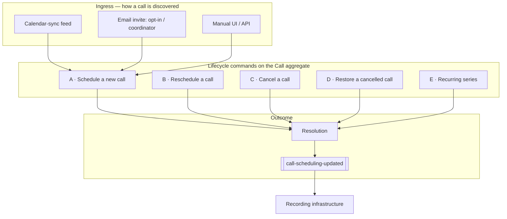

# 04 · Use Cases — Hub

> [[_dashboard|← Team Hub]] · [[00 - Overview]] · [[03 - Ubiquitous Language]] · next → [[05 - Onboarding Checklist]]

Every way the Call Scheduling domain acts on a `Call`, split into one page per use case and grouped by lifecycle verb. Each page is written **from the user's perspective** — what they wanted, what they did, and what happens downstream — in the style of [[07 - End-to-End User Flow]].

Start with [[Use Cases/A - Schedule/A1 - Calendar Sync Schedule|UC-A1]] (the highest-volume flow), or jump to any use case from the list below.

---

## At a glance

Three axes organize every use case (all defined in [[03 - Ubiquitous Language]]):

| Axis | Role |
|---|---|
| **`CallCreationMechanism`** | The dispatch key — *how* the call came to be. Selects the validation chain and event subtype. |
| **`Resolution`** | The outcome vocabulary — the "why" of every decision (60+ members). Every use case ends in exactly one. |
| **`CallSchedulingCRUDOperation`** | The lifecycle verb stamped on the produced event — `NEW`, `UPDATE`, `CANCEL`, `NONE`. The signal to recording infrastructure. |

---

## All use cases

### A — Schedule *(the aggregate is created)*
- [[Use Cases/A - Schedule/A1 - Calendar Sync Schedule|UC-A1 · Calendar sync schedule]] — `NEW_CALL` / `NEW`
- [[Use Cases/A - Schedule/A2 - Opt-In Email Invite|UC-A2 · Opt-in email invite]] — `NEW_CALL` / `NEW`
- [[Use Cases/A - Schedule/A3 - Coordinator Invite-Handler|UC-A3 · Coordinator / invite-handler email]] — rejoins A1
- [[Use Cases/A - Schedule/A4 - Manual Schedule|UC-A4 · Manual schedule (UI / API)]] — `NEW_CALL` / `NEW`

### B — Reschedule *(the aggregate moves in time)*
- [[Use Cases/B - Reschedule/B1 - Reschedule On Time Change|UC-B1 · Reschedule on time change]] — `RESCHEDULED` / `UPDATE`

### C — Cancel *(the aggregate is deactivated)*
- [[Use Cases/C - Cancel/C1 - Cancel By Owner|UC-C1 · Cancel by owner]] — `CANCEL_BY_OWNER`
- [[Use Cases/C - Cancel/C2 - Cancel By Compliance Email|UC-C2 · Cancel by compliance email]] — `CANCEL_BY_COMPLIANCE_EMAIL`
- [[Use Cases/C - Cancel/C3 - Cancel On Resolution Change|UC-C3 · Cancel on resolution change]] — `COMPLIANCE_ENFORCING`, …
- [[Use Cases/C - Cancel/C4 - Cancel By Company And Provider|UC-C4 · Cancel by company + provider]] — `CALL_PROVIDER_DISABLED_FOR_COMPANY`
- [[Use Cases/C - Cancel/C5 - Cancel Internal Meetings|UC-C5 · Cancel internal-meeting recordings]] — `INTERNAL_MEETING_RECORDING_DISABLED`
- [[Use Cases/C - Cancel/C6 - Cancel Blacklisted Calls|UC-C6 · Cancel blacklisted calls]] — `CALL_BLACKLISTED`

### D — Restore *(the aggregate is reactivated)*
- [[Use Cases/D - Restore/D1 - Restore Cancelled Call By Owner|UC-D1 · Restore cancelled call by owner]] — `RESTORED_BY_OWNER` / `UPDATE`

### E — Recurring series *(keyed by `ical_uid`)*
- [[Use Cases/E - Recurring/E1 - Schedule Recurring Occurrences|UC-E1 · Schedule recurring occurrences]] — `NEW_CALL_RECURRING`
- [[Use Cases/E - Recurring/E2 - Cancel Recurring Series|UC-E2 · Cancel recurring series]] — `CANCEL` (+ `CancellationReason`)

### F — Operational & cross-context
- [[Use Cases/F - Operational/F1 - Purge A Company|UC-F1 · Purge a company]] — tenant offboarding
- [[Use Cases/F - Operational/F2 - Sync Provider Users And Tokens|UC-F2 · Sync provider users / tokens]] — keeps `CallInDetails` resolving
- [[Use Cases/F - Operational/F3 - Emit Scheduling History|UC-F3 · Emit scheduling history]] — audit/search trail
- [[Use Cases/F - Operational/F4 - Hand Off To Recording|UC-F4 · Hand off to recording]] — the bounded-context boundary

---

## See also

- [[07 - End-to-End User Flow]] — UC-A1 walked through end to end (the template these pages follow)
- [[03 - Ubiquitous Language]] — the vocabulary every term here comes from
- [[02 - Entry Points (Inbound & Outbound)]] — which topic / controller / line each use case rides on
- [[00 - Overview]] — the mental model in prose
- [[Subsystems/Call Scheduling/Canvas/Call Scheduling - Data Flow.canvas|Data-flow canvas]] — the 10,000-ft view
