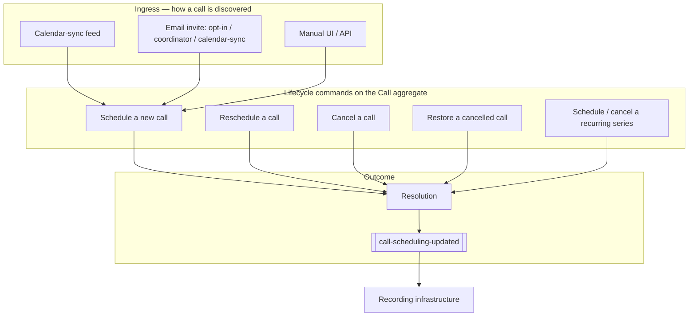
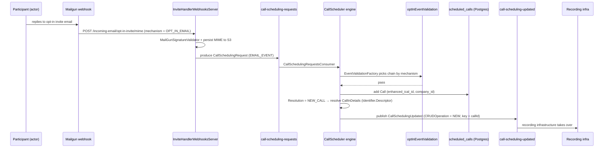

# 04 · Use Cases

> [[_dashboard|← Team Hub]] · [[00 - Overview]] · [[03 - Ubiquitous Language]] · next → [[05 - Onboarding Checklist]]

The **use cases** of the Call Scheduling domain — each written the DDD way: an **actor** pursues a
**goal** by issuing a **command** against the **`Call` aggregate**; the command runs a **validation
chain** chosen by the `CallCreationMechanism`; on success the aggregate transitions and the outcome
is recorded as a **`Resolution`** and published as a **domain event**.

Read [[03 - Ubiquitous Language]] first — every bold term below is defined there and is a real
type/enum/method in code. This page is the *behavioural* view (what the system does and why); the UL
is the *vocabulary*, and [[02 - Entry Points (Inbound & Outbound)]] is the *plumbing* (which topic,
which controller, which line).

---

## How to read a use case

Every use case is stated in one canonical sentence:

> **[Actor]** wants to **[goal]**, so the system runs **[command / process]** — validated by the
> **[validation chain]** — which transitions the **`Call`** and records **`Resolution.[X]`**, publishing
> **[event]** with **`CallSchedulingCRUDOperation.[NEW/UPDATE/CANCEL]`**.

The three moving parts, all from the UL:

| Part | The DDD role | The central axis |
|---|---|---|
| **`CallCreationMechanism`** | The **dispatch key** — *how* the call came to be. Selects the validation chain and the event subtype. | This is *the* organizing axis of the whole domain. |
| **`Resolution`** | The **outcome vocabulary** — the rich "why" of every decision (60+ members, with precedence). | Every use case ends in exactly one `Resolution`. |
| **`CallSchedulingCRUDOperation`** | The **lifecycle verb** stamped on the produced event — `NEW`, `UPDATE`, `CANCEL`, `NONE`. | The boundary signal to recording infrastructure. |

---

## The domain's use cases at a glance

Use cases are grouped by lifecycle verb. Within each, the **`CallCreationMechanism`** distinguishes
the variants — that's the DDD "one goal, many mechanisms" pattern, and it's why the code branches on
that enum everywhere.

---

## Group A — Discover & schedule a call *(the aggregate is created)*

The core creational use cases. All converge on **`SchedulingCallService#addCallFromCalendarAndReport`**
(or `ManualSchedulingCallService#scheduleNewCallManually` for the manual variant), run the
**`generalEventValidation`** chain (or `optInEventValidation` for opt-in), and — on pass — **add** a
`Call` to `scheduled_calls`, resolving the conferencing **`Identifier.Descriptor`** into a
**`CallInDetails`**.

### UC-A1 · Schedule a call discovered by calendar sync

> **The calendar-sync feed** (upstream: [[Subsystems/Calendar Ingestion/_dashboard|Calendar Ingestion]])
> wants a recordable meeting captured, so it produces a **`CallSchedulingRequest`**
> (`CallSchedulingEventType.CALENDAR_EVENT`) on **`call-scheduling-requests`**; the engine consumes it,
> runs **`generalEventValidation`**, and on pass records **`Resolution.NEW_CALL`**, publishing
> **`CallSchedulingCalendarEventUpdated`** (`NEW`).

- **Mechanism:** `CALENDAR_INGESTER` (new path) — the `CalendarEvent` ingress axis.
- **Command:** `SchedulingCallService#addCallFromCalendarAndReport`.
- **Idempotency:** a `scheduled_calls` row keyed by **`enhanced_ical_id`** — re-delivery does not double-schedule.
- **Failure vocabulary (sample):** `USER_NOT_MARKED_FOR_RECORDING`, `CALL_PROVIDER_DISABLED_FOR_COMPANY`,
  `INTERNAL_MEETING_RECORDING_DISABLED`, `CALL_BLACKLISTED`, `COMPLIANCE_ENFORCING`.

### UC-A2 · Schedule a call from an **opt-in** email invite

> **A meeting participant** (often a non-Gong user) wants to consent to recording via email, so the
> **opt-in** invite hits `IncomingMailgunController` (`/incoming-email/opt-in-invite/mime`) with
> mechanism **`OPT_IN_EMAIL`**; it runs the **`optInEventValidation`** chain and, on pass, schedules the
> call and sends an opt-in reply (`OptInEmailResponseSender.EmailType.Onetime_Successful`).

- **Mechanism:** `OPT_IN_EMAIL` (`CallCreationMechanism.isOptIn()`), an **`EMAIL_EVENT`** ingress.
- **Why it's distinct:** opt-in has its own validators (wrapped by `ConditionalValidation`) and its own
  reply-email side effect — a different chain from calendar-sync.
- **Non-Gong user path:** `Request_To_Record_By_Non_Gong_User` reply variant.

### UC-A3 · Schedule a call from a **coordinator** or **calendar-sync** email invite

> An invite arrives **out-of-band from calendar sync** (mechanism **`COORDINATOR_EMAIL`** or
> **`CALENDAR_SYNC_EMAIL`** = the *invite-handler*), routed by `getGenericFlowHandler` /
> `getTenantFlowHandler`; `EmailHandlerService#handle` validates + normalizes and (if from GGE) produces
> a `CallSchedulingRequest` back onto `call-scheduling-requests` — rejoining the UC-A1 engine path.

- **Say "invite-handler"** for `CALENDAR_SYNC_EMAIL` (`isInviteHandler()`), *not* "calendar sync" — see
  the jargon table in [[03 - Ubiquitous Language]].
- **GGE bridge:** `GlobalInviteHandlerWebhooksController` resolves the cell from the recipient and
  forwards raw to the right GPE cell.

### UC-A4 · Schedule a call **manually** (UI / API)

> **A Gong user or internal API** wants to schedule a recording directly, so `ScheduledCallsActionsController#scheduleNewCallManually`
> invokes **`ManualSchedulingCallService#scheduleNewCallManually`** with mechanism **`MANUAL`**; it emits
> **`ManualCallEventUpdated`** (`NEW`) — the manual event subtype.

- **Mechanism:** `MANUAL` — bypasses the calendar/email ingress entirely.
- **Contract:** request body `ManualSchedulingCallDetails` (the API is defined in `gong-clients`).

---

## Group B — Reschedule a call *(the aggregate moves in time)*

### UC-B1 · Reschedule when the meeting time changes

> The **calendar-sync feed** reports a moved meeting, so the engine calls
> **`SchedulingCallService#rescheduleCallUpdateAndReport`**, which updates the existing `Call` and records
> **`Resolution.RESCHEDULED`** — or **`TOO_LATE_TO_RESCHEDULE`** if the original start has effectively passed.

- **Dedup:** `updated_calendar_event` (keyed by `enhanced_ical_id`) tracks last-seen create/modified
  timestamps so an unchanged re-delivery is a no-op.
- **Event:** `CallSchedulingCalendarEventUpdated` (`UPDATE`).

---

## Group C — Cancel a call *(the aggregate is deactivated)*

The richest area — the **same goal (stop this recording) reached by many mechanisms**, each with its own
`Resolution`. This is the canonical "one verb, many reasons" DDD surface; the reason is *not* incidental,
it's first-class vocabulary on the produced event.

| Use case | Actor / trigger | Command (`CancelCallService#…`) | `Resolution` |
|---|---|---|---|
| **UC-C1 · Cancel by owner** | A user cancels from the UI | `cancelByOwnerScheduledCall` | `CANCEL_BY_OWNER` (+ `SkipCode.CANCELED_BY_OWNER`) |
| **UC-C2 · Cancel by compliance email** | A compliance/consent email withdraws consent | `cancelByComplianceEmailScheduledCall` | `CANCEL_BY_COMPLIANCE_EMAIL` |
| **UC-C3 · Cancel because resolution changed** | The calendar/consent decision flips against recording | `SchedulingCallService#cancelExistingCallDueToResolutionChange` | e.g. `COMPLIANCE_ENFORCING`, `USER_NOT_MARKED_FOR_RECORDING` |
| **UC-C4 · Cancel by company + provider** | A provider is disabled for a tenant | `cancelScheduledCalls` (`CallDataDao#cancelScheduledCallsByCallProvider`) | `CALL_PROVIDER_DISABLED_FOR_COMPANY` |
| **UC-C5 · Cancel internal-meeting recordings** | Internal-meeting recording is turned off | `cancelScheduledInternalMeetingsCallsRecordings` | `INTERNAL_MEETING_RECORDING_DISABLED` |
| **UC-C6 · Cancel blacklisted calls** | A call matches the blacklist | `CancelBlacklistedCallsController#cancelBlacklistedCalls` | `CALL_BLACKLISTED` |

All cancels stamp **`CallSchedulingCRUDOperation.CANCEL`** on the produced event and set the cancel state
via **`SkipCode` + `Resolution`** (there is *no* `CallStatus` enum — see the UL caveat).

---

## Group D — Restore a call *(the aggregate is reactivated)*

### UC-D1 · Restore a cancelled call by owner

> **A user** who cancelled by mistake wants the recording back, so `ScheduledCallsActionsController#restoreCancelledCallByOwner`
> invokes **`RestoreCancelledCallService#restoreCancelledCallByOwner`**, recording **`Resolution.RESTORED_BY_OWNER`**
> and emitting an `UPDATE` event.

- **Recurring variant:** `#restoreCancelledRecurringCallByOwner` restores a whole series.
- The restore path is the exact inverse of UC-C1 and reuses the same aggregate.

---

## Group E — Recurring series *(a set of occurrences, keyed by `ical_uid`)*

Recurring is its own bounded sub-area because it's keyed **differently** — by **`ical_uid`** in
`calendar_recurring_event`, *not* `enhanced_ical_id`. It also branches on **`MailboxProviderCode`**
(Google vs Office) because the two calendars express recurrence cancellation differently.

### UC-E1 · Schedule upcoming occurrences of a recurring meeting

> The **background recurring engine** (`recurring-events-call-scheduler` scheduled task, every 2h) wants
> upcoming occurrences recorded, so **`RecurringEventService#processRecurringEventBatches`** scans the
> `RecurringEventSetDto` window and schedules each occurrence — recording **`Resolution.NEW_CALL_RECURRING`**.

- **Model:** `RecurringEventSetDto` = `initialEvent` + `eventExceptions`, expanded to occurrences.
- **Change classification:** `RecurringEventChange` (`CancelledMainEvent`, `UpdatedEventOccurrence`, …).

### UC-E2 · Cancel a recurring series

> A recurring meeting is cancelled; **`CancelCallService#cancelScheduledRecurringCall`** branches by
> `callCreationMechanism.isEmail()` vs `isFromCalendarIngester()` **and** by `MailboxProviderCode`
> (Google vs Office), marking `calendar_recurring_event.should_cancel_recurring_event` and persisting a
> **`CancellationReason`** (`CANCELLED_MAIN_EVENT`, `USER_NOT_ACTIVE`, …).

- **Office quirk:** `CalendarRecurringEventsService#shouldCancelRecurringOfficeEvent` owns the iCal↔recurringId
  map and the "should cancel" cache — the Office path needs it because Office and Google encode series
  cancellation differently.

---

## Group F — Operational & cross-context use cases

These aren't the core scheduling verb but a new hire will meet them fast; they keep the aggregate correct
across tenant lifecycle and provider state. Full plumbing in [[02 - Entry Points (Inbound & Outbound)]].

| Use case | Trigger | What happens |
|---|---|---|
| **UC-F1 · Purge a company** | `PurgeCompany` on `purge-company` (`OPERATIONAL_V1`) | Tenant offboarding — remove the company's scheduled calls. |
| **UC-F2 · Sync provider users/tokens** | `SyncUsersFromProviderEvent` on `sync-users-from-web-conferencing-provider` (`DATA_CAPTURE`); `webex-import-users`, `webex-refresh-tokens`, `zoom-import-meetings` tasks | Keep conferencing-provider auth + user mapping fresh so `CallInDetails` resolves. |
| **UC-F3 · Emit scheduling history** | `CallSchedulingHistoryProducer` → `call-scheduling-history` → bulk-index | Audit/search trail into OpenSearch `CALENDAR_EVENTS_HISTORY`. |
| **UC-F4 · Hand off to recording** | `CallSchedulingUpdatedProducer` → `call-scheduling-updated` (keyed by `callId`) | **The bounded-context boundary** — where scheduling ends and recording begins. |

---

## Worked example — one event, end to end

Follow a single opt-in invite through the whole domain (UC-A2), naming each DDD element as it fires:

**The same sentence template, filled in:** *A **participant** wants to consent to recording, so the
system runs **the opt-in scheduling command** — validated by **`optInEventValidation`** — which **adds**
the **`Call`** and records **`Resolution.NEW_CALL`**, publishing **`CallSchedulingUpdated`** with
**`CallSchedulingCRUDOperation.NEW`**.*

---

## Use-case → code map (jump table)

Every command is grounded in [[03 - Ubiquitous Language]] §4 (Domain Services / Processes).

| Use case | Command entry point | Resolution(s) | Event / CRUD |
|---|---|---|---|
| UC-A1 calendar-sync schedule | `SchedulingCallService#addCallFromCalendarAndReport` | `NEW_CALL` | `CallSchedulingCalendarEventUpdated` / `NEW` |
| UC-A2 opt-in schedule | opt-in chain → `addCallFromCalendarAndReport` | `NEW_CALL` | `CallSchedulingUpdated` / `NEW` |
| UC-A3 coordinator/invite-handler | `EmailHandlerService#handle` → produce `CallSchedulingRequest` | (rejoins A1) | — |
| UC-A4 manual schedule | `ManualSchedulingCallService#scheduleNewCallManually` | `NEW_CALL` | `ManualCallEventUpdated` / `NEW` |
| UC-B1 reschedule | `SchedulingCallService#rescheduleCallUpdateAndReport` | `RESCHEDULED` / `TOO_LATE_TO_RESCHEDULE` | `…CalendarEventUpdated` / `UPDATE` |
| UC-C1 cancel by owner | `CancelCallService#cancelByOwnerScheduledCall` | `CANCEL_BY_OWNER` | `…Updated` / `CANCEL` |
| UC-C2 cancel by compliance | `CancelCallService#cancelByComplianceEmailScheduledCall` | `CANCEL_BY_COMPLIANCE_EMAIL` | `…Updated` / `CANCEL` |
| UC-C3 cancel on resolution change | `SchedulingCallService#cancelExistingCallDueToResolutionChange` | `COMPLIANCE_ENFORCING`, … | `…Updated` / `CANCEL` |
| UC-C4 cancel by provider | `CancelCallService#cancelScheduledCalls` | `CALL_PROVIDER_DISABLED_FOR_COMPANY` | `…Updated` / `CANCEL` |
| UC-C5 cancel internal meetings | `CancelCallService#cancelScheduledInternalMeetingsCallsRecordings` | `INTERNAL_MEETING_RECORDING_DISABLED` | `…Updated` / `CANCEL` |
| UC-C6 cancel blacklisted | `CancelBlacklistedCallsController#cancelBlacklistedCalls` | `CALL_BLACKLISTED` | `…Updated` / `CANCEL` |
| UC-D1 restore | `RestoreCancelledCallService#restoreCancelledCallByOwner` | `RESTORED_BY_OWNER` | `…Updated` / `UPDATE` |
| UC-E1 recurring schedule | `RecurringEventService#processRecurringEventBatches` | `NEW_CALL_RECURRING` | per-occurrence |
| UC-E2 recurring cancel | `CancelCallService#cancelScheduledRecurringCall` | + `CancellationReason` | `…Updated` / `CANCEL` |

---

## See also

- [[03 - Ubiquitous Language]] — the vocabulary every term here comes from
- [[02 - Entry Points (Inbound & Outbound)]] — which topic / controller / line each use case rides on
- [[00 - Overview]] — the mental model in prose
- [[05 - Onboarding Checklist]] — put these use cases into practice locally
- [[Subsystems/Call Scheduling/Canvas/Call Scheduling - Data Flow.canvas|Data-flow canvas]] — the 10,000-ft view
