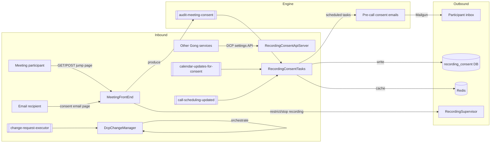

# 02 · Data Flow — Inbound & Outbound

> [[_dashboard|← Team Hub]] · [[00 - Overview]] · [[01 - Services & Modules]] · [[Storage & Schema Reference]] · next → [[03 - Ubiquitous Language]]

Every way data **enters** and **leaves** the Recording Consent subsystem, grounded in code. Every
`file:line` was verified against the mounted source. Prefixes: **GDC/** = `gong-data-capture`,
**HF/** = `honeyfy` monolith.

> [!info] 5 deployables + shared monolith code
> `gong-data-capture` ships **5 deployable services** — two **public** (`MeetingFrontEnd`,
> `ConsentWebApi`) and three **internal** (`RecordingConsentApiServer`, `RecordingConsentTasks`,
> `DcpChangeManager`) — plus `ConsentCommon` (lib) and `MeetingFrontEndUI` (React). Much of the
> consent-email / consent-settings / compliance model lives in the **honeyfy** modules `ConsentProfile`
> and `RecordingCompliance` and is wired into these services. All services deploy to **GPE**, Sentry team `consent`.

---

## 🗺️ The shape in one picture

---

## Modules at a glance (from `*.gong-app-descriptor.yaml`)

| Module | Type | Public | Kafka clusters | Postgres | Scheduled |
|---|---|---|---|---|---|
| **MeetingFrontEnd** | webapi-server | **yes** (`/`) | `RECORDING_CONSENT` (W), `APP_USER` (W) | `OPERATIONAL`, `RECORDING_CONSENT`, `DATA_CAPTURE` | no |
| **RecordingConsentApiServer** | api-server | no | `DATA_CAPTURE`, `APP_USER`, `OPERATIONAL_V1` (consumes `purge-company`) | +`SCHEDULED_TASKS_01/02` | **yes** |
| **RecordingConsentTasks** | api-server | no | `RECORDING_CONSENT` (6 topics), `CALL_SCHEDULER_V2` (consumes `call-scheduling-updated`), `APP_USER` | +`RECORDING_CONSENT_TIMED_EVENTS` | **yes** |
| **DcpChangeManager** | api-server | no | `DATA_CAPTURE` (consumes `change-request-executor`), `RECORDING_CONSENT` (W) | `OPERATIONAL`, `DATA_CAPTURE`, `RECORDING_CONSENT` | **yes** |
| **ConsentWebApi** | webapi-server | **yes** (`/consentwebapi`) | `APP_USER` (W) | `OPERATIONAL`, `USER_AUTH` | no |

Redis logical DB in code is **`RECORDING_COMPLIANCE`** (`HF/DataCaptureProfile/.../redis/JedisWrapper.java:291`) — descriptors call the connection `CONSENT_REDIS`, but that's not the Java enum name.

---

# INBOUND

## 1 · REST controllers

### Public participant-facing (MeetingFrontEnd)

**`JumpPageController`** (`@RestController`, `GDC/MeetingFrontEnd/.../controller/JumpPageController.java:85`) — the consent page itself. Paths are absolute from `/`:

| Method | Path | Handler `:line` | Body |
|---|---|---|---|
| GET | `/{profileKey}/{userKey}/{meetingKey}` | `viewJumpPage:286` | — (dynamic meeting page) |
| GET | `/{profileKey}/{userKey}` | `viewJumpPage:303` | — (PMI / static page) |
| POST | `/{profileKey}/{userKey}/{meetingKey}` | `acceptAnswer:614` | — |
| POST | `/{profileKey}/{userKey}` | `acceptAnswer:634` | — |
| POST | `/{profileKey}/{userKey}/{meetingKey}/skip-answer` | `skipAnswer:653` | — |
| POST | `/{profileKey}/{userKey}/skip-answer` | `skipAnswer:674` | — |
| GET/POST | `/preview`, `/v2/preview`, `/preview-logo` | `preview:201`, `setPreviewDetails:248` | `DcpJumpPageUrlSettings` (POST) |
| POST | `/csp-report` | `handleCspReport:945` | `CspReportWrapper` |

**`ConsentEmailController`** (`@RestController`, `GDC/MeetingFrontEnd/.../controller/ConsentEmailController.java:30`) — the consent-**email** landing page:

| Method | Path | Handler `:line` | Body |
|---|---|---|---|
| GET | `{CONSENT_EMAIL_URL}/{obfuscatedCompanyId}/{emailId}` | `getConsentEmailPage:52` | — |
| POST | `{CONSENT_EMAIL_URL}/{obfuscatedCompanyId}/{emailId}` | `answerConsentEmailPage:84` | `UiConsentEmailResponse` |

### Internal API controllers

| Controller `:line` | Implements (gong-clients) | Methods |
|---|---|---|
| `DcpConsentSettingsController` — `GDC/RecordingConsentApiServer/.../controllers/DcpConsentSettingsController.java:25` | `DcpConsentSettingsApi` | `readDcpJumpPageSettingsWithUser:53`, `saveUserProviderDefault:61` |
| `JumpPageSettingsChangeDetectorController` — `RecordingConsentApiServer/.../controllers/JumpPageSettingsChangeDetectorController.java:27` | `JumpPageSettingsChangeDetectorApi` | `detectChanges(DcpJumpPageSettings):37` |
| `UserSettingsController` — `RecordingConsentTasks/.../controllers/UserSettingsController.java:19` | `ConsentUserSettingsApi` | `getUserSettings:31`, `saveUserSettings:42`, `resetUserSettings:53` |
| `MicrosoftTeamsAttendanceReportController` — `ConsentWebApi/.../controllers/MicrosoftTeamsAttendanceReportController.java:31` | — (`@RequestMapping` MS Teams attendance) | `downLoadReport:37` (CSV), `getAttendanceReportDetails:52` |

> The three gong-clients-contract controllers carry **no in-file mapping annotations** — verbs/paths/bodies
> are declared on the interfaces in `gong-clients` (not mounted).

### Troubleshooting controllers

**14 troubleshooting controllers** (+ 1 `TestController`), no gong-clients contract. Heaviest surfaces:
`TroubleshootingDcpJumpPageRedis` (**32 endpoints**, `RecordingConsentTasks/.../rest/TroubleshootingDcpJumpPageRedis.java:50`),
`DcpChangeManagerTroubleshooter` (**14**, `DcpChangeManager/.../troubleshooting/DcpChangeManagerTroubleshooter.java:49`),
`TroubleshootingConsentEmail` (**10**), `TroubleshootingMicrosoftTeams` (6), `TroubleshootingDataCaptureProfile` /
`TroubleshootingProtectPmiFeatureDisplayed` (5 each).

## 2 · Kafka consumers

All wired **programmatically** (`configurer.configureSingle(...)` in a `@Configuration static class Beans`,
implementing `SingleRecordConsumer`) — no `@KafkaListener`. Default concurrency 4.

| Consumer `:line` | Module | Cluster | Topic (literal) | Payload |
|---|---|---|---|---|
| `AuditMeetingConsentConsumer:26` | RecordingConsentTasks | `RECORDING_CONSENT` | `audit-meeting-consent` | `JumpPageInteractionEvent` |
| `AuditStopRecordingConsumer:25` | RecordingConsentTasks | `RECORDING_CONSENT` | `audit-stop-recording` | `StopRecordingEvent` |
| `CalendarUpdatesForConsentConsumer:24` | RecordingConsentTasks | `RECORDING_CONSENT` | `calendar-updates-for-consent` | `CalendarUpdateEvent` |
| `ConsentEmailPageInteractionConsumer:22` | RecordingConsentTasks | `RECORDING_CONSENT` | `consent-email-page-interaction` | `ConsentEmailPageInteractionEvent` |
| `ResetConsentRedisForCompanyConsumer:17` | RecordingConsentTasks | `RECORDING_CONSENT` | `reset-consent-redis-for-company` | `ResetConsentRedisForCompanyEvent` |
| `ChangeRequestExecutorConsumer:24` | DcpChangeManager | `DATA_CAPTURE` | `change-request-executor` | `DcpChangeRequestEvent` |
| `SingleUserChangeExecutorConsumer:23` | DcpChangeManager | `DATA_CAPTURE` | `single-user-change-executor` | `DcpChangeRequestEvent` |
| `BatchUsersChangeExecutorConsumer:23` | DcpChangeManager | `DATA_CAPTURE` | `batch-users-change-executor` | `DcpChangeRequestEvent` |
| `SingleUserChangeRequestDoneConsumer:23` | DcpChangeManager | `DATA_CAPTURE` | `single-user-change-request-done` | `DcpUserChangeRequestDoneEvent` |
| `RecordingConsentPurgeCompanyConsumer:23` | RecordingConsentApiServer | `OPERATIONAL_V1` | `purge-company` | `PurgeCompany` (concurrency 1) |

**Wired into RecordingConsentTasks but defined in HF/ConsentProfile** (imported at `RecordingConsentTasksConfig.java:112-122`):
- `ConsentCallSchedulingUpdatedConsumer` (`HF/ConsentProfile/.../callschedulingupdated/ConsentCallSchedulingUpdatedConsumer.java:26`) — cluster `CALL_SCHEDULER_V2`, topic **`call-scheduling-updated`**, payload `CallSchedulingUpdated`. **This is the direct hand-off from [[Subsystems/Call Scheduling/02 - Entry Points (Inbound & Outbound)|Call Scheduling]].**
- `ConsentEmailAuditConsumer` (`consent-email-audit`), `ConsentEmailExecutorConsumer` (`send-consent-email`), `CheckAndFixConsentPageRedisConsumer` (`check-and-fix-consent-page-redis`).
- `recording-consent-time-based-events` — consumed via the `TimeBasedEventsScheduler` framework (`ConsentProfileTimeBasedEventsConfig.java:39`, 3 threads), not a dedicated class.

## 3 · Scheduled tasks

No `@Scheduled` — every task is a programmatic `@Bean ScheduledTask` run by a `DistributedScheduledTaskExecutor`
(engine bean `RecordingConsentApiServerConfig.java:110-117`, lock-backed by `SCHEDULED_TASKS_01/02`). All in
**RecordingConsentTasks** (imported `RecordingConsentTasksConfig.java:82-90`). ~20 tasks; the notable ones:

| Task (`class#method`, `:line`) | Cadence | Purpose |
|---|---|---|
| `ConsentEmailsTasks#consentEmailScheduledTask` `ConsentEmailsTasks.java:48` | every 1m | **Send pre-call consent emails** |
| `ConsentEmailsTasks#unprotectedLinkUsedScheduledTask:34` | every 1m | React to unprotected-link usage |
| `ConsentEmailsTasks#notifyConsentEmailOptOutScheduledTask:77` | every 1m | Opt-out notifications |
| `JumpPageSettingsChangeTask#*` `JumpPageSettingsChangeTask.java:36-125` | 1–2m | Settings-change emails (provider switch, enable/enforce, disable, setup…) |
| `PopulateConsentRedisWithAccessorsTask:56` | prod every 5m | Warm consent-email Redis accessors |
| `PopulateDcpJumpPageRedisTask:93` | prod every 5m | Warm jump-page / DCP Redis |
| `DeletePastMeetingsFromCalendarEventTableTask:55` | daily 07:00 | Cleanup calendar-event rows |
| `DcpEmailJobsProcessingTask#queuedEmailsJobProcessor:69` | every 1m | Drain queued email jobs |

## 4 · SQS / distributed-task executors

**None.** No `GongTask` / `SqsGongTaskExecutor` / `SingleQueueTaskSubmitter` anywhere. Async work is Kafka +
the DB-coordinated scheduled-task executor only.

---

# OUTBOUND

## 5 · Kafka producers

| Producer (`class#method`, `:line`) | Cluster | Topic (literal) | Event / key |
|---|---|---|---|
| `JumpPageController.publishInteractionEvent` `MeetingFrontEnd/.../JumpPageController.java:765,775` | `RECORDING_CONSENT` | `audit-meeting-consent` | `JumpPageInteractionEvent` / companyId |
| `UiConsentEmailService` `MeetingFrontEnd/.../UiConsentEmailService.java:207` | `RECORDING_CONSENT` | `consent-email-audit` | `ConsentEmailAuditEvent` / companyId |
| `ChangeRequestLifecycle.onNewChangeRequest` `DcpChangeManager/.../ChangeRequestLifecycle.java:50,69` | `DATA_CAPTURE` | `batch-users-change-executor` | `DcpChangeRequestEvent` / companyId |
| `ChangeRequestLifecycle.onBatchUserActionsDone:97` | `DATA_CAPTURE` | `single-user-change-executor` | `DcpChangeRequestEvent` / userId |
| `ChangeRequestLifecycle.onSingleUserChangeRequestDone:107` | `DATA_CAPTURE` | `single-user-change-request-done` | `DcpUserChangeRequestDoneEvent` / changeRequestId |
| `ConsentEmailBackFillAction.Beans` `DcpChangeManager/.../ConsentEmailBackFillAction.java:96` | `RECORDING_CONSENT` | `recording-consent-time-based-events` | `ScheduleEventDTO` |

## 6 · Outbound HTTP clients (not Feign)

**Zero `@FeignClient` in the subsystem.** Outbound HTTP is via plain honeyfy client libraries:

- **`RecordingSupervisorClient`** (`HF/RecordingSupervisorClient/.../client/RecordingSupervisorClient.java:7`) — the consent→recorder boundary. `restrictCallRecording(...):11` (start/restrict on consent), `markRecordingStop:13`, `getCallStatus:9`. Wired in `MeetingFrontEnd/.../config/MeetingFrontEndConfig.java:182`, injected `JumpPageController.java:119`.
- **`FeatureFlagsClient`** (REST-polling, `HF/BackEndClients/.../FeatureFlagsClient.java:36`) — feature gating; used across `JumpPageController`, `UiConsentEmailService`, `CspFilterConfiguration`.

## 7 · Database writes — DB `recording_consent`

| DAO#method `:line` | Op | Table.schema |
|---|---|---|
| `RecordingComplianceDao.insertJumpPageSession` `RecordingConsentTasks/.../dao/RecordingComplianceDao.java:35` | INSERT | `recording_compliance.jump_page_session` |
| `RecordingComplianceDao.insertJumpPageInteraction:43` | INSERT | `recording_compliance.jump_page_interaction` |
| `RecordingComplianceDao.updateInteractionsCountInCall:84` | UPDATE | `public.call` (operational) |
| `RecordingComplianceDao.auditCallStoppingStatus:93` | INSERT | `recording_compliance.stop_recording_audit` |
| `UserSettingsDao.upsert` `RecordingConsentTasks/.../service/UserSettingsDao.java:18` | UPSERT | `recording_consent_settings.user_settings` |
| `DcpChangeManagerDao.*` `DcpChangeManager/.../service/DcpChangeManagerDao.java:86+` | UPD/DEL/UPSERT | `data_capture_profile` change-request tables |
| **HF** `ConsentMeetingUpdatesDao.upsertEventData` `HF/RecordingCompliance/.../service/ConsentMeetingUpdatesDao.java:31` | UPSERT | `recording_consent_settings.calendar_event` |
| **HF** `DcpConsentSettingsDao.upsertAppUserConsentSettings` `HF/ConsentProfile/.../consentsettings/service/DcpConsentSettingsDao.java:35` | UPSERT | `recording_consent_settings.appuser_consent_settings` |
| **HF** `DcpConsentEmailRecordingConsentDao.*` `HF/ConsentProfile/.../consentemail/service/DcpConsentEmailRecordingConsentDao.java:49+` | INS/UPD/DEL/UPSERT | `recording_consent_email.*` (consent_email, audit, company_obfuscation, history) |

See [[Storage & Schema Reference]] for the schema-level map. For columns/PKs, use `kb_table(action=schema)`.

## 8 · Redis (write-through cache)

Logical DB **`RECORDING_COMPLIANCE`**. Write-through base `AbstractRedisWithFallbackAccessor.set()` (DB first, then Redis).

- `PopulateConsentRedisWithAccessorsTask:40` — bulk consent-email accessors (page-data, call-details, obfuscation).
- `PopulateDcpJumpPageRedisTask:63` — per-company jump-page / DCP compliance settings.
- `ResetConsentRedisForCompanyConsumer:49` — company cache eviction.
- Accessors: `ConsentEmailIdToConsentEmailPageDataAccessor:22` (+ CallId / ObfuscatedCompanyId / RevisionId siblings).

## 9 · Email send (Mailgun)

- **Real send:** `PreCallEmailService#sendEmail → templateEmailSender.sendEmail(...)` `RecordingConsentTasks/.../tasks/PreCallEmailService.java:481` (chain `sendEmails:214 → sendEmailToRecipient:417 → :457 → :481`). `TemplateEmailSender` = `ThymeLeafEmailSender` + `MailgunEmailSender` (`RecordingConsentTasksConfig.java:40,74`).
- **Enqueue:** `ConsentEmailSender#sendConsentEmail` `HF/ConsentProfile/.../consentemail/service/ConsentEmailSender.java:55 → enqueueConsentEmail:161`.

---

## Corrections to the repo `CLAUDE.md`

| CLAUDE.md says | Reality (verified) |
|---|---|
| MeetingFrontEnd uses **Feign** clients (`RecordingSupervisorClient`, `FeatureFlagsClient`) | No `@FeignClient` anywhere — both are plain honeyfy HTTP client classes |
| Implies `@Scheduled` scheduled tasks | None — all are programmatic `ScheduledTask` beans on a `DistributedScheduledTaskExecutor` |
| Redis referred to as `CONSENT_REDIS` | Java logical-DB enum is `RECORDING_COMPLIANCE`; `CONSENT_REDIS` is only the descriptor connection name |
| `RecordingComplianceDao` implied shared | It's the **gong-data-capture** class; the honeyfy consent writer is `ConsentMeetingUpdatesDao` |

## See also

- [[00 - Overview]] · [[01 - Services & Modules]] · [[Storage & Schema Reference]]
- [[03 - Ubiquitous Language]] — the domain vocabulary behind these types
- [[Subsystems/Call Scheduling/Canvas/Consent/Consent - Data Flow.canvas|Data-flow canvas]] — the 10,000-ft view
- [[Subsystems/Call Scheduling/02 - Entry Points (Inbound & Outbound)]] — upstream via `call-scheduling-updated`
