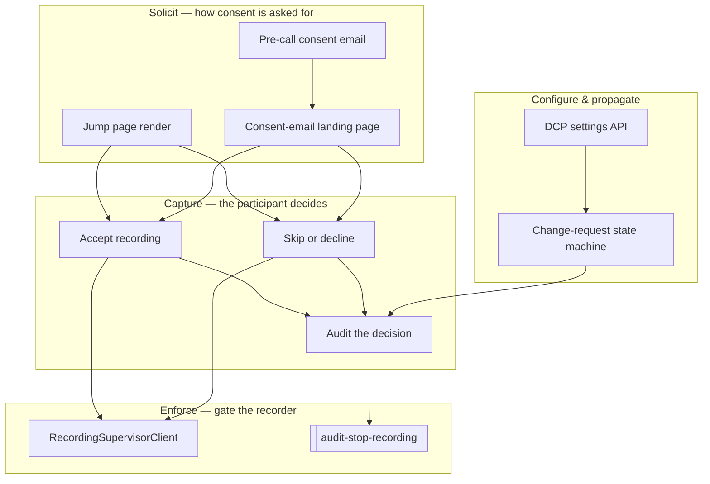

# 04 · Use Cases — Hub

> [[_dashboard|← Team Hub]] · [[00 - Overview]] · [[03 - Ubiquitous Language]] · [[02 - Data Flow]]

Every way the Recording Consent domain acts on a `Data Capture Profile (DCP)` and its jump page, split into one page per use case and grouped by lifecycle verb. Each page is written **from the user's perspective** — what they wanted, what they did, and what happens downstream (for participant-facing flows), or what the flow is for and what triggers it (for system-driven flows).

Start with [[Use Cases/A - Solicit/A1 - Render Jump Page|UC-A1]] (what a participant first sees), or jump to any use case below.

---

## At a glance

Three axes organize every use case (all defined in [[03 - Ubiquitous Language]]):

| Axis | Role |
|---|---|
| **`Data Capture Profile (DCP)`** | The policy — whether recording needs consent and what the jump page enforces, per company / provider. |
| **Consent-capture channel** | *How* consent is solicited: the **jump page** (`profileKey/userKey[/meetingKey]`) vs the **pre-call consent email** (`emailId`). |
| **`MeetingStatus`** | The outcome vocabulary — `RECORDING`, `RECORDING_CANCELLED`, `CALL_CANCELLED`. Every consent decision resolves the recording state. |

---

## All use cases

### A — Solicit consent *(the consent artifact is served)*
- [[Use Cases/A - Solicit/A1 - Render Jump Page|UC-A1 · Render the jump page]] — participant sees the consent page
- [[Use Cases/A - Solicit/A2 - Send Pre-Call Consent Email|UC-A2 · Send a pre-call consent email]] — scheduled task, Mailgun
- [[Use Cases/A - Solicit/A3 - Render Consent Email Landing Page|UC-A3 · Render the consent-email landing page]] — email recipient answers

### B — Capture the decision *(recorded & audited)*
- [[Use Cases/B - Capture/B1 - Accept Recording|UC-B1 · Accept recording]] — `MeetingStatus.RECORDING`
- [[Use Cases/B - Capture/B2 - Skip Or Decline|UC-B2 · Skip / decline recording]] — `MeetingStatus.RECORDING_CANCELLED`
- [[Use Cases/B - Capture/B3 - Audit The Decision|UC-B3 · Audit the decision]] — `recording_compliance` audit trail

### C — Enforce consent on the recorder *(the boundary to recording)*
- [[Use Cases/C - Enforce/C1 - Restrict Recording|UC-C1 · Restrict recording on decision]] — `RecordingSupervisorClient#restrictCallRecording`
- [[Use Cases/C - Enforce/C2 - Stop Recording|UC-C2 · Stop recording]] — `audit-stop-recording` → stop + audit

### D — Configure the DCP *(the policy is set)*
- [[Use Cases/D - Configure/D1 - Read Write DCP Settings|UC-D1 · Read / write DCP consent settings]] — Feign `DcpConsentSettingsClient`
- [[Use Cases/D - Configure/D2 - Manage One-Time Meeting|UC-D2 · Manage a one-time (dynamic) jump-page meeting]] — `OneTimeMeetingStatus`

### E — Propagate a settings change *(the change-request state machine)*
- [[Use Cases/E - Propagate/E1 - Orchestrate Change Request|UC-E1 · Orchestrate a DCP change request]] — `ChangeRequestLifecycle`
- [[Use Cases/E - Propagate/E2 - Run Change Action|UC-E2 · Run a concrete change action]] — cancel / backfill / sync actions

### F — React to upstream & lifecycle events *(cross-context)*
- [[Use Cases/F - React/F1 - React To Scheduled Call|UC-F1 · React to a scheduled / cancelled call]] — from Call Scheduling
- [[Use Cases/F - React/F2 - React To Calendar Update|UC-F2 · React to a calendar update]] — consent calendar mirror
- [[Use Cases/F - React/F3 - Reset Consent Cache|UC-F3 · Reset a company's consent cache]] — Redis eviction
- [[Use Cases/F - React/F4 - Purge Company|UC-F4 · Purge a company (GDPR)]] — tenant offboarding
- [[Use Cases/F - React/F5 - Gate A Consent Feature|UC-F5 · Gate a consent feature]] — feature flag (scaffolding)

---

## See also

- [[03 - Ubiquitous Language]] — the vocabulary every term here comes from
- [[02 - Data Flow]] — which topic / controller / line each use case rides on
- [[00 - Overview]] — the mental model in prose
- [[Storage & Schema Reference]] — the `recording_consent` DB and its three schemas
- [[Subsystems/Call Scheduling/Use Cases/F - Operational/F4 - Hand Off To Recording|Call Scheduling UC-F4]] — the upstream producer of `call-scheduling-updated` that UC-F1 consumes
