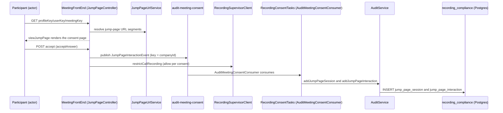

# 04 · Use Cases

> [[_dashboard|← Team Hub]] · [[00 - Overview]] · [[03 - Ubiquitous Language]] · [[02 - Data Flow]]

The **use cases** of the Recording Consent domain — each written the DDD way: an **actor** pursues a
**goal** by invoking a **command / process** against the **`Data Capture Profile (DCP)`** and its
**jump page**; the process changes consent state, is **audited** (`AuditService` → `recording_compliance`),
and is carried out as a **domain event** on Kafka (or a direct call to the **`RecordingSupervisorClient`**).

Read [[03 - Ubiquitous Language]] first — every bold term below is defined there and is a real
type/enum/method/table in code. This page is the *behavioural* view (what the system does and why); the
UL is the *vocabulary*, and [[02 - Data Flow]] is the *plumbing* (which topic, which controller, which
line).

---

## How to read a use case

Every use case is stated in one canonical sentence:

> **[Actor]** wants to **[goal]**, so the system runs **[`Class#method` / process]** against the
> **`DCP` / jump page** — which **[state change / audit]** and publishes **[event]** (or calls
> **`RecordingSupervisorClient`**).

The three moving parts, all from the UL:

| Part | The DDD role | The central axis |
|---|---|---|
| **`Data Capture Profile (DCP)`** | The **policy** — whether recording needs consent and what the jump page enforces, per company / provider. | This is *the* organizing axis of the whole domain. |
| **Consent-capture channel** | *How* consent is solicited: the **jump page** (`profileKey/userKey[/meetingKey]`) vs the **pre-call consent email** (`emailId`). | The secondary axis — "one goal, two channels". |
| **`MeetingStatus`** | The **outcome vocabulary** — `RECORDING`, `RECORDING_CANCELLED`, `CALL_CANCELLED`, derived from `CallStatus` + `SkipCode`. | Every consent decision resolves the recording state. |

---

## The domain's use cases at a glance

Use cases are grouped by lifecycle verb. Within each, the **consent-capture channel** distinguishes the
variants (jump page vs pre-call consent email) — that's the DDD "one goal, many channels" pattern, and
it's why the code splits between `JumpPageController` and `ConsentEmailController` everywhere.

---

## Group A — Solicit consent *(the consent artifact is served)*

The creational use cases. All converge on either the **jump page** (in-meeting-join) or the **pre-call
consent email** (ahead of the call). The jump-page URL is always built by **`JumpPageUrlService`** as
`profileKey/userKey[/meetingKey]`.

### UC-A1 · Render the jump page to a participant

> **A meeting participant** wants to see whether the meeting is being recorded, so `MeetingFrontEnd`
> runs **`JumpPageController#viewJumpPage`** against the company's **`DcpJumpPageSettings`** — which
> serves the **jump page** (dynamic 3-segment or PMI 2-segment) resolved from the
> **`profileKey/userKey[/meetingKey]`** URL.

- **Channel:** the **jump page** (a.k.a. "consent page" — say *jump page* in code).
- **URL grammar:** 2 segments = **PMI / static** page, 3 = **dynamic / one-time** meeting
  (`PROFILE_KEY_PART_INDEX`, `USER_KEY_PART_INDEX`, `MEETING_KEY_PART_INDEX`).
- **In-flight state:** one render/answer is modelled by **`ConsentPageRequestData`** (aggregating
  **`ConsentPageRequestResult`**).
- **Failure vocabulary:** `AuthorizationFailureType` (`CALENDAR_EMAIL_UNDEFINED`, `EMPTY_TOKEN`,
  `INVALID_TOKEN`).

### UC-A2 · Send a pre-call consent email

> **`RecordingConsentTasks`** (the `ConsentEmailsTasks#consentEmailScheduledTask`, every 1m) wants
> participants to consent before the call, so it runs **`PreCallEmailService#sendEmail`** (real Mailgun
> send) — or enqueues via **`ConsentEmailSender#sendConsentEmail`** — producing a **`ConsentEmailPageData`**
> (keyed by **`emailId`**) that the recipient can answer.

- **Channel:** the **pre-call consent email**.
- **Lifecycle:** the email carries the `isEmailIdObsolete` flag — obsoletion is its lifecycle.
- **Audit event:** answering it later emits **`ConsentEmailAuditEvent`** on `consent-email-audit`.

### UC-A3 · Render the consent-email landing page

> **An email recipient** who opened the consent email wants to answer it, so `MeetingFrontEnd` runs
> **`ConsentEmailController#getConsentEmailPage`** (`{CONSENT_EMAIL_URL}/{obfuscatedCompanyId}/{emailId}`)
> — which serves the landing page whose per-call subject is the **`ConsentEmailCall`** /
> **`ConsentEmailCallDetails`** (deriving a **`MeetingStatus`**).

- **Contract:** POST answer body is `UiConsentEmailResponse` (`answerConsentEmailPage`).
- **Rejoins UC-B:** answering here produces a `ConsentEmailPageInteractionEvent`, consumed by
  `ConsentEmailPageInteractionConsumer` — the email-channel equivalent of a jump-page answer.

---

## Group B — Capture the consent decision *(the decision is recorded & audited)*

The heart of the domain: a participant's accept / skip becomes a first-class, audited event.

### UC-B1 · Accept recording

> **A participant** wants to consent to being recorded, so `JumpPageController#acceptAnswer` captures
> the decision, publishes a **`JumpPageInteractionEvent`** on **`audit-meeting-consent`**, and calls
> **`RecordingSupervisorClient#restrictCallRecording`** to allow/restrict recording accordingly.

- **Event:** `JumpPageInteractionEvent` (keyed by companyId) → consumed by `AuditMeetingConsentConsumer`.
- **Outcome state:** resolves toward `MeetingStatus.RECORDING`.

### UC-B2 · Skip / decline recording

> **A participant** who does not consent uses `JumpPageController#skipAnswer` — which records the skip,
> publishes the same **`JumpPageInteractionEvent`**, and drives recording toward
> **`MeetingStatus.RECORDING_CANCELLED`** via the recorder.

- **URL variants:** `.../skip-answer` on both the dynamic (3-segment) and PMI (2-segment) paths.

### UC-B3 · Audit the decision

> The **`AuditMeetingConsentConsumer`** consumes the `JumpPageInteractionEvent` and runs
> **`AuditService#addJumpPageSession`** / **`#addJumpPageInteraction`** — writing the compliance audit
> trail into **`recording_compliance.jump_page_session`** and **`jump_page_interaction`** (mirrored in
> data-capture by **`RecordingComplianceDao`**).

- **Say "compliance" (audit), not "consent" (decision):** `recording_compliance` = the audit trail;
  `recording_consent_settings` = the policy/decision.
- **Counters:** `AuditService#countAnswers` aggregates the interaction counts.

---

## Group C — Enforce consent on the recorder *(the boundary to recording)*

The **same goal (make the recorder obey the decision) reached through two mechanisms** — a direct client
call and an event-mediated stop. This is the bounded-context boundary where consent ends and recording
begins.

| Use case | Actor / trigger | Command / process | Outcome |
|---|---|---|---|
| **UC-C1 · Restrict recording on decision** | Participant accepts/skips (UC-B1/B2) | `RecordingSupervisorClient#restrictCallRecording` | Recorder starts / restricts per consent |
| **UC-C2 · Stop recording** | `audit-stop-recording` event fires | `AuditStopRecordingConsumer` → `AuditService#auditCallStoppingStatus` → `RecordingSupervisorClient#markRecordingStop` | Recording stopped and stop is audited into `recording_compliance.stop_recording_audit` |

> **Caveat (from the UL):** the consent→recorder link had **no direct caller** in the four consent
> packages — the wiring is **event-mediated** via **`StopRecordingEvent`** / `audit-stop-recording`, or
> lives outside those roots. Treat `RecordingSupervisorClient` as the seam, not a tight coupling.

---

## Group D — Configure the DCP *(the policy is set)*

### UC-D1 · Read / write DCP consent settings

> **Another Gong service** (via the `DcpConsentSettingsClient` Feign client) wants a company's consent
> policy, so `RecordingConsentApiServer` runs **`DcpConsentSettingsController#readDcpJumpPageSettingsWithUser`**
> / **`#saveUserProviderDefault`** — reading/writing **`recording_consent_settings.appuser_consent_settings`**
> (DAO `DcpConsentSettingsDao`) and **`user_settings`** (DAO `UserSettingsDao`).

- **Per-user resolution:** `DcpAppUserConsentService` (monolith) resolves the effective per-user policy.
- **Change detection:** `JumpPageSettingsChangeDetectorController#detectChanges(DcpJumpPageSettings)`.

### UC-D2 · Schedule / manage a one-time (dynamic) jump-page meeting

> **An admin flow** wants a per-meeting jump page, so **`JumpPageAdminService#scheduleMeeting`** (and
> `#updateOnetimeMeeting` / `#deleteOnetimeMeeting`) drives the **`OneTimeMeetingStatus`** lifecycle
> (`CREATED → SCHEDULED → DELETED`), choosing a provider via `#chooseMeetingProvider`.

- **Custom URL keys:** `#validateUserUrlKey` returns `URL_KEY_VALIDATION` (`OK`, `INVALID_CHARACTERS`,
  `LENGTH_ISSUE`, `EXIST`).

---

## Group E — Propagate a settings change *(the change-request state machine)*

A DCP settings change is not a single write — it **fans out across users** through a first-class state
machine. Keyed by **`changeRequestId`**, driven by **`ChangeRequestLifecycle`**.

### UC-E1 · Orchestrate a DCP change request

> **An admin change to the DCP** must reach every affected user, so **`DcpChangeActionsOrchestrator`**
> (with `DcpBatchUserChangeActionOrchestrator` / `DcpSingleUserChangeActionOrchestrator`) runs the
> **`ChangeRequestLifecycle`** — emitting **`DcpChangeRequestEvent`** across `batch-users-change-executor`
> → `single-user-change-executor` and, on completion, **`DcpUserChangeRequestDoneEvent`** on
> `single-user-change-request-done`.

- **Consumers:** `ChangeRequestExecutorConsumer`, `BatchUsersChangeExecutorConsumer`,
  `SingleUserChangeExecutorConsumer`, `SingleUserChangeRequestDoneConsumer` (all `DcpChangeManager`).
- **State + persistence:** `DcpChangeManagerDao` writes the change-request tables.

### UC-E2 · Run a concrete change action

> Each change request executes concrete actions: **`CancelNonCompliantCallsAction`**,
> **`ConsentEmailSettingsChangeAction`**, **`SyncMeetingPmiAction`**, **`ConsentEmailBackFillAction`** —
> e.g. `ConsentEmailBackFillAction` produces **`ScheduleEventDTO`** onto
> `recording-consent-time-based-events`.

- **Backfill bridge:** the time-based-events topic feeds the `TimeBasedEventsScheduler` framework in
  `RecordingConsentTasks`.

---

## Group F — React to upstream & lifecycle events *(cross-context)*

These aren't the core consent verb but a new hire meets them fast; they keep the consent state correct
across scheduling, calendar, and tenant lifecycle. Full plumbing in [[02 - Data Flow]].

| Use case | Trigger | What happens |
|---|---|---|
| **UC-F1 · React to a scheduled/cancelled call** | `CallSchedulingUpdated` on `call-scheduling-updated` (from Call Scheduling) | `ConsentCallSchedulingUpdatedConsumer` → **`DcpConsentEmailSchedulingService#handleEvent`** schedules or cancels the consent email. |
| **UC-F2 · React to a calendar update** | `CalendarUpdateEvent` on `calendar-updates-for-consent` | `CalendarUpdatesForConsentConsumer` → **`ConsentMeetingUpdatesService#handleUpdate`** upserts the consent calendar mirror (`recording_consent_settings.calendar_event`, via `ConsentMeetingUpdatesDao`). |
| **UC-F3 · Reset a company's consent cache** | `ResetConsentRedisForCompanyEvent` on `reset-consent-redis-for-company` | `ResetConsentRedisForCompanyConsumer` evicts the company's `RECORDING_COMPLIANCE` Redis cache. |
| **UC-F4 · Purge a company (GDPR)** | `PurgeCompany` on `purge-company` (`OPERATIONAL_V1`, concurrency 1) | `RecordingConsentPurgeCompanyConsumer` removes the company's consent state. |
| **UC-F5 · Gate a consent feature** | Any consent code path checking a flag | **`ConsentFeatureDao#isFeatureEnabled(RecordingConsentFeatureName)`** (Guava-cached; enum has only `FOR_TEST` today — scaffolding). |

---

## Worked example — one decision, end to end

Follow a single participant answering the jump page through the whole domain (UC-A1 → UC-B1 → UC-C1 →
UC-B3), naming each DDD element as it fires:

**The same sentence template, filled in:** *A **participant** wants to consent to recording, so the
system runs **`JumpPageController#acceptAnswer`** against the **`DCP` / jump page** — which publishes
**`JumpPageInteractionEvent`** on `audit-meeting-consent`, calls **`RecordingSupervisorClient#restrictCallRecording`**,
and audits the decision into **`recording_compliance.jump_page_session`** via **`AuditService`**.*

---

## Use-case → code map (jump table)

Every command is grounded in [[03 - Ubiquitous Language]] §4 (Domain Services / Processes).

| Use case | Command / process entry point | Event / topic | State / audit |
|---|---|---|---|
| UC-A1 render jump page | `JumpPageController#viewJumpPage` | — (HTTP) | serves `DcpJumpPageSettings` page |
| UC-A2 send consent email | `PreCallEmailService#sendEmail` / `ConsentEmailSender#sendConsentEmail` | `ConsentEmailAuditEvent` / `consent-email-audit` | `ConsentEmailPageData` (`emailId`) |
| UC-A3 consent-email page | `ConsentEmailController#getConsentEmailPage` / `#answerConsentEmailPage` | `ConsentEmailPageInteractionEvent` / `consent-email-page-interaction` | `ConsentEmailCallDetails` → `MeetingStatus` |
| UC-B1 accept | `JumpPageController#acceptAnswer` | `JumpPageInteractionEvent` / `audit-meeting-consent` | `MeetingStatus.RECORDING` |
| UC-B2 skip | `JumpPageController#skipAnswer` | `JumpPageInteractionEvent` / `audit-meeting-consent` | `MeetingStatus.RECORDING_CANCELLED` |
| UC-B3 audit decision | `AuditService#addJumpPageSession` / `#addJumpPageInteraction` | consumed via `AuditMeetingConsentConsumer` | `recording_compliance.jump_page_session` / `jump_page_interaction` |
| UC-C1 restrict recording | `RecordingSupervisorClient#restrictCallRecording` | (direct client call) | recorder starts / restricts |
| UC-C2 stop recording | `AuditService#auditCallStoppingStatus` → `RecordingSupervisorClient#markRecordingStop` | `StopRecordingEvent` / `audit-stop-recording` | `recording_compliance.stop_recording_audit` |
| UC-D1 read/write DCP settings | `DcpConsentSettingsController#readDcpJumpPageSettingsWithUser` / `#saveUserProviderDefault` | — (REST) | `recording_consent_settings.appuser_consent_settings` / `user_settings` |
| UC-D2 one-time meeting | `JumpPageAdminService#scheduleMeeting` / `#updateOnetimeMeeting` / `#deleteOnetimeMeeting` | — | `OneTimeMeetingStatus` |
| UC-E1 orchestrate change | `DcpChangeActionsOrchestrator` → `ChangeRequestLifecycle` | `DcpChangeRequestEvent` / `batch-users-change-executor`, `single-user-change-executor` | `DcpChangeManagerDao` change-request tables |
| UC-E2 change action | `CancelNonCompliantCallsAction`, `ConsentEmailSettingsChangeAction`, `SyncMeetingPmiAction`, `ConsentEmailBackFillAction` | `ScheduleEventDTO` / `recording-consent-time-based-events` | per-action |
| UC-F1 react to scheduling | `DcpConsentEmailSchedulingService#handleEvent` | `CallSchedulingUpdated` / `call-scheduling-updated` | schedule/cancel consent email |
| UC-F2 react to calendar | `ConsentMeetingUpdatesService#handleUpdate` | `CalendarUpdateEvent` / `calendar-updates-for-consent` | `recording_consent_settings.calendar_event` |
| UC-F4 purge company | `RecordingConsentPurgeCompanyConsumer` | `PurgeCompany` / `purge-company` | company consent state removed |

---

## See also

- [[03 - Ubiquitous Language]] — the vocabulary every term here comes from
- [[02 - Data Flow]] — which topic / controller / line each use case rides on
- [[00 - Overview]] — the mental model in prose
- [[Storage & Schema Reference]] — the `recording_consent` DB and its three schemas
