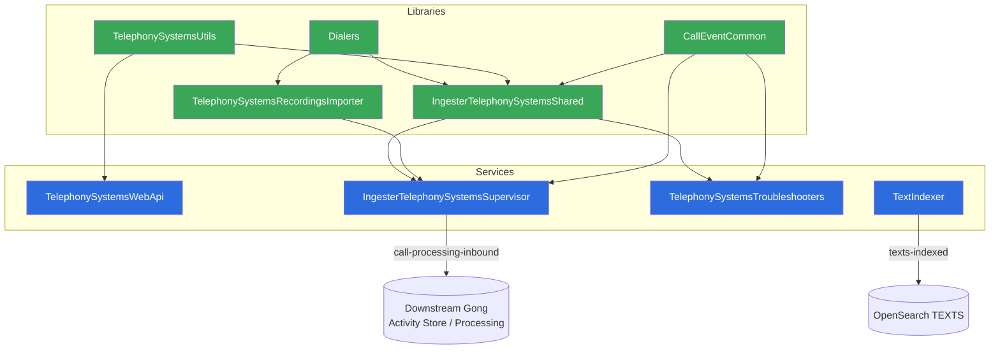

# 01 · Architecture & Modules

> [[_dashboard|← Team Hub]] · [[00 - Overview]] · next → [[02 - Data Flows]]

The repo is a **Maven multi-module aggregator** (`com.honeyfy.telephony:gong-telephony-systems`,
parent `gong-parent-pom:17.main.200`). 9 modules: **4 deployable Spring Boot services**
(each builds a container image) and **5 shared libraries** (`container.image.skip=true`).

## Deployable services

| Module | Image name | Type | Role |
|---|---|---|---|
| **TelephonySystemsWebApi** | `telephonysystemswebapi` | `webapi-server` (public, `/telephonysystemswebapi`) | Public/BFF API for configuring telephony integrations & OAuth. |
| **IngesterTelephonySystemsSupervisor** | `ingestertelephonysystemssupervisor` | `api-server` (internal) | The ingestion brain — Kafka consumers, scheduled syncs, producers, REST/troubleshooter API. |
| **TelephonySystemsTroubleshooters** | `telephonysystemstroubleshooters` | `api-server` (internal) | Diagnostics over ingestion/dialer data; writes audit + troubleshooting indices. |
| **TextIndexer** | `textindexer` | `api-server` (internal) | Indexes call text into OpenSearch from Kafka. *Owned by deal-intelligence.* |

## Shared libraries

| Module | Role |
|---|---|
| **Dialers** | Per-provider import logic (Salesforce dialers, Five9, RingCentral, Truly, FTP, MS Teams, Verint…), SMS, CRM association, secrets, notifier, sync-job, call-update services. The functional core. |
| **CallEventCommon** | Call-event domain model + Kafka infra (dialer/webconf call-update producers, GDM call-event sender), CRM/activity-store association, workspaces, feature flags. |
| **IngesterTelephonySystemsShared** | Shared ingestion code (API upload, user backfill, importation, troubleshooters) on top of `Dialers` + the `TelephonySystemsApi`/`TelephonySystemsClient` contracts. |
| **TelephonySystemsUtils** | Lightweight common utilities + CRM-association helpers. |
| **TelephonySystemsRecordingsImporter** | Recordings import pipeline: Kafka consumers, importers (S3, Salesforce dialer, RingCentral, public API, cloud storage), DAO, call-to-activity conversion. |

## Module dependency graph



Arrows point in the direction of the **dependency / data flow**. Libraries never depend
on services.

## Deployment

- All 4 services deploy to the **GPE** environment via
  `com.honeyfy.webutil.deploy.AwsAutoDiscoveryRollingDeployment`.
- **Crossplane-managed** (`managedByCrossplane: true`), AWS-backed, rolling deploys.
- `IngesterTelephonySystemsSupervisor` and `TelephonySystemsTroubleshooters` need
  **external CMK access** (`externalCmkAccessNeeded: true`) — they decrypt
  customer-owned data with customer KMS keys.

## Where things live (repo layout)

```
gong-telephony-systems/
├── pom.xml                              # aggregator: declares the 9 modules
├── TelephonySystemsWebApi/              # [service] public web API
├── IngesterTelephonySystemsSupervisor/  # [service] ingestion orchestrator
├── TelephonySystemsTroubleshooters/     # [service] diagnostics API
├── TextIndexer/                         # [service] text → OpenSearch
├── Dialers/                             # [lib] per-provider import logic
├── CallEventCommon/                     # [lib] call-event domain + Kafka infra
├── IngesterTelephonySystemsShared/      # [lib] shared ingestion code
├── TelephonySystemsUtils/               # [lib] utilities
├── TelephonySystemsRecordingsImporter/  # [lib] recordings import pipeline
├── .run/                                # IntelliJ Spring Boot run configs
└── .claude/skills/create-telephony-ticket/  # team Jira-ticket skill
```

A repo-level `README.md` with build/clone instructions also lives at the root of the repo.
