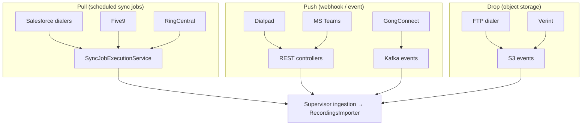

# 04 · Providers & Dialers

> [[_dashboard|← Team Hub]] · [[03 - Services Reference]] · next → [[05 - Observability]]

All provider-specific integration logic lives in the **`Dialers`** library
(`Dialers/src/main/java/com/honeyfy/dialers/`). Import logic is under `importcalls/`.

## Supported providers

### Salesforce-based dialers (`importcalls/salesforce/`)

These integrate via Salesforce as the system of record (calls logged as SF tasks/activities):

- Lightning
- DialSource
- SalesLoft
- InsideSales
- InsideSales Playbooks
- RingDNA
- Talkdesk
- Groove
- Outreach
- ConnectAndSell
- ConnectLeader
- ChaseData
- Marketo Sales Engage
- Natterbox
- SendBloom

Shared SF logic: `SdrService`, `SdrCallCreator`, `SdrSyncService`, `SdrTask`,
`TaskProperties`, `SyncStats`.

### Direct provider integrations

- **Five9** (`importcalls/five9/`)
- **RingCentral** (`importcalls/ringcentral/`)
- **Truly** (`importcalls/truly/`)
- **FTP dialer** (`importcalls/ftpdialer/`)
- **MS Teams** (`objects/msteams/`, `common/zoom`, MsTeams consumers/controllers in Supervisor)
- **Verint** (`services/VerintDialerService`)
- **Dialpad** (`DialpadController` / `DialpadTroubleshooter` in Supervisor)

> The exact set evolves. Source of truth is the `importcalls/` + `services/` directory
> listing in the `Dialers` module — re-check there before assuming a provider is/ isn't supported.

## Cross-cutting dialer services (`Dialers/.../services/`)

| Area | Package |
|---|---|
| CRM association (+ retry) | `services/crm`, `services/crm/associationretry` |
| Notifications | `services/notifier` |
| Secrets | `services/secrets` |
| Sync jobs (scheduled polling) | `services/syncjob` |
| Call updates | `services/callupdate` |
| ATS | `services/ats` |
| Gong Connect | `services/gongconnect` |
| SMS | `sms/` |

## Ingestion modes by provider type

## Adding a new provider (high level)

1. Add provider logic under `Dialers/.../importcalls/<provider>` (or `salesforce/<provider>`).
2. Wire it into the appropriate ingestion mode (sync job, webhook controller, or S3 handler).
3. Register provider credentials/config via **ProviderIntegrationManager**.
4. Add a `*Troubleshooter` endpoint if support needs to inspect/replay it.
5. Add wiring-test coverage (app-descriptor `applications:` entries for any new Feign deps).

> Confirm the current pattern against an existing recent provider before starting — this is
> a sketch, not a substitute for reading the code.
