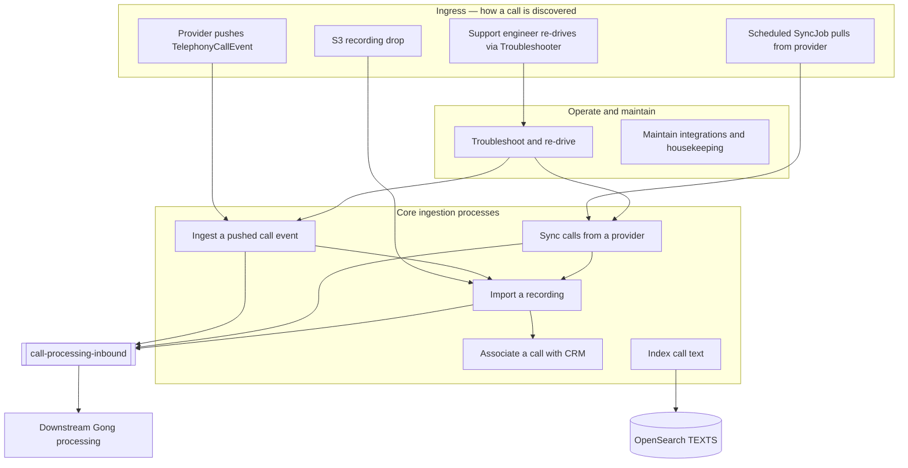
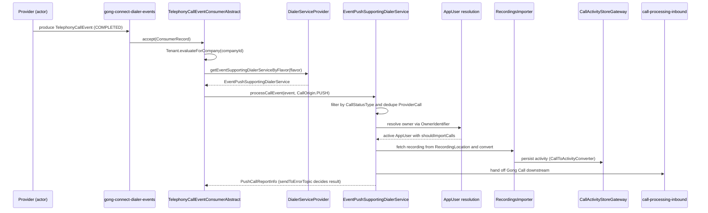

# 09 · Use Cases

> [[_dashboard|← Team Hub]] · [[00 - Overview]] · [[08 - Ubiquitous Language]] · [[02 - Data Flows]]

The **use cases** of the Telephony Systems domain — each written the DDD way: an **actor** (a
provider, a scheduler, or a support engineer) pursues a **goal** by triggering a **process** against
a call; the process is dispatched by **`IntegrationFlavor`** to a concrete **`AbstractDialerService`**,
which resolves the **owner `AppUser`** and the **integration**, tags the call with a **`CallOrigin`**,
and — on success — hands the Gong **`Call`** off downstream on **`call-processing-inbound`**.

Read [[08 - Ubiquitous Language]] first — every bold term below is defined there and is a real
type/enum/method in code. This page is the *behavioural* view (what the system does and why); the UL
is the *vocabulary*, and [[02 - Data Flows]] is the *plumbing* (which topic, which consumer, which
controller).

---

## How to read a use case

Every use case is stated in one canonical sentence:

> **[Actor]** wants to **[goal]**, so the system runs **[process / command]** — dispatched by
> **`IntegrationFlavor`** to a **`{dialer service}`** — which resolves the owner **`AppUser`** and the
> integration, tags the call **`CallOrigin.[X]`**, and hands off to **`call-processing-inbound`**.

The three moving parts, all from the UL:

| Part | The DDD role | The central axis |
|---|---|---|
| **`IntegrationFlavor`** | The **dispatch key** — provider + connection variant (~65 values). Selects the concrete dialer service and maps to an **`Identifier.Descriptor`**. | This is *the* organizing axis of the whole domain — the code branches on this enum everywhere. |
| **`CallOrigin`** | The **provenance tag** — *why/how* a call entered: `PUSH`, `SYNC`, `BACKFILL`, `TROUBLESHOOTER`, `UPDATED_CALL`, `MANUAL_UPLOAD`. | The one tag that distinguishes push from pull from replay. |
| **`CallStatus`** / **`RecordingStatus`** (+ **`SkipCode`**) | The **outcome vocabulary** — is the call *processable* (`COMPLETED`/`FAILED`, any `RecordingStatusType`), or skipped and why (`SkipCode`). | Every ingestion ends in a processable call or a recorded skip reason. |

**The central axis of the domain is Push vs Pull** (UL §5): a provider *pushes* a `TelephonyCallEvent`
onto Kafka, or a scheduled `SyncJob` *pulls* calls from the provider. Everything else hangs off that
split.

---

## The domain's use cases at a glance

Use cases are grouped by the domain's real lifecycle verbs — **ingest**, **sync**, **import**,
**associate**, **index**, **troubleshoot**, **maintain**. Within each, the **`IntegrationFlavor`**
distinguishes the variants — that's the DDD "one goal, many providers" pattern, and it's why
`DialerServiceProvider` exists to pick the right `AbstractDialerService`.

---

## Group A — Ingest a pushed call event *(Push — `CallOrigin.PUSH`)*

A provider (or Gong Connect, or the Public API) emits a `TelephonyCallEvent` as the call happens. The
consumer's `accept(...)` deserializes it and delegates to the shared core,
**`EventPushSupportingDialerService#processCallEvent`** — the exact same method every push path runs.

### UC-A1 · Ingest a dialer call event

> **A provider/dialer** wants a completed call captured, so it produces a **`TelephonyCallEvent`** on
> **`gong-connect-dialer-events`**; **`TelephonyCallEventConsumerAbstract#accept`** resolves the flavor
> by descriptor, picks the **`EventPushSupportingDialerService`** via **`DialerServiceProvider#getEventSupportingDialerServiceByFlavor`**,
> and runs **`processCallEvent`** with **`CallOrigin.PUSH`**.

- **Filter:** only `CallStatusType.COMPLETED`/`FAILED` are processable — `STARTED`/`IN_PROGRESS` are skipped.
- **Owner resolution:** `OwnerIdentifier` (`APPUSER_ID` or `EMAIL`) → an `AppUser` that must be `active` + `shouldImportCalls`.
- **Outcome:** returns **`PushCallReportInfo`** — whose `sendToErrorTopic` decides the HTTP/consumer result (the [[processcallevent README|8-path map]]).
- **Non-recorded still ingests:** `RecordingStatusType.NON_RECORDED` calls ingest metadata (see `TsNonRecordedCallsProcessingStatusConsumer`).

### UC-A2 · Ingest a low-priority (public-API) call event

> **The Public API** (`PUBLIC_API_EVENT_PUSH` flavor) emits the same payload on a separate lane, so
> **`LowPriorityTelephonyCallEventConsumer`** runs the identical `processCallEvent` core off
> **`low-priority-dialer-events`** — isolating high-volume API traffic from the primary lane.

### UC-A3 · Ingest a Gong Connect call event

> **Gong Connect** (Gong's own calling product) reports a call, so **`GongConnectCallEventConsumer`**
> consumes **`gong-connect-call-event`** and runs the same push ingestion — the flavor `GONG_CONNECT_API`.

All push variants converge on `processCallEvent`, resolve the integration, dedupe the provider call
(`ProviderCallInterface` / `PushedEventCall`), create/finalize the Gong `Call` via `CallService`, and
hand off on `call-processing-inbound`.

---

## Group B — Sync calls from a provider *(Pull — `CallOrigin.SYNC` / `BACKFILL`)*

We poll the provider on a schedule (or on demand). A `SyncJob` — the aggregate root, keyed by
`integrationId` — is dropped on SQS; an executor picks it up and runs the full company sync.

### UC-B1 · Run a periodic sync

> **The scheduled sync chain** wants new calls since the last watermark, so a **`SyncJob`**
> (`SyncType.PERIODIC_SYNC`) lands on `SQSQueues.DIALERS_SYNC_HIGH_PRIORITY`; **`HighPrioritySyncJobMsgExecutor`**
> (`AbstractSyncJobMsgExecutor#execute`) establishes tenant context and calls
> **`SyncJobExecutionService#runSyncJobForCompany`**, which lists calls from the provider, handles them
> in batches (`#handleCalls`), and advances the **`CompanySyncDto`** periodic-sync watermark.

- **Dispatch:** `DialerServiceProvider#getDialerServiceByFlavor` → the concrete `AbstractDialerService` (OAuth / S3 / SFTP subclass).
- **Initial vs periodic:** separate watermarks in `CompanySyncDto` (`INITIAL_SYNC_DAYS_BACK` vs `PERIODIC_SYNC_DAYS_BACK`, `isInitialSyncSeparated()`) — don't conflate them.
- **Outcome:** `SyncJobResults` with a `SyncJobStatus` (`COMPLETED_SYNC`, `CONTINUOUS_SYNC`, `RETRYABLE_ERROR`, `PERMANENT_ERROR`).

### UC-B2 · Run a backfill

> **A new connection or a reset** needs history, so a **`SyncJob`** with a `*_BACKFILL` `SyncType`
> (`NEW_CONNECTION_BACKFILL`, `USER_BACKFILL`, `INTEGRATION_RESET_BACKFILL`, `MANUAL_BACKFILL`) and
> `backfill=true` lands on `SQSQueues.DIALERS_SYNC_LOW_PRIORITY`; **`LowPrioritySyncJobMsgExecutor`**
> runs it with `CallOrigin.BACKFILL` — a retroactive fetch, distinct from ongoing sync.

### UC-B3 · Apply an after-the-fact call update

> **A later sync pass** carries **`CallUpdateType`** work (`ASSOCIATE_AND_UPDATE_TITLE`,
> `UPDATE_PROSPECT_PHONE_NUMBER`, `ADD_PROVIDER_CALL_ID_REFERENCE`), so `#handleOneCall` applies the
> update to an already-ingested call rather than creating a new one.

### UC-B4 · Ingest an S3-dropped recording *(object-driven pull)*

> **A provider drops a recording into S3**, so an S3 event drives `S3EventHandler` /
> `AbstractS3EventsDialerService` (`AMAZON_CONNECT_S3`-style flavors) to fetch and ingest the call —
> the object-driven variant of pull.

---

## Group C — Import a recording *(fetch + convert the media)*

Metadata ingestion (Groups A/B) resolves the call; the **`RecordingsImporter`** library pulls the
actual audio and converts it to an activity.

### UC-C1 · Import a telephony/external recording

> **The ingestion pipeline** requests audio for a call, so a recording-import request lands on
> **`telephony-recordings-import-requests`** (or `external-recordings-import-requests`);
> **`TelephonyRecordingsImportRequestsConsumer`** (resp. `ExternalRecordingsImportRequestsConsumer`)
> resolves the provider + credentials, fetches the media from its **`RecordingLocation`**
> (`S3RecordingLocation` / `UrlRecordingLocation`), stores it, and runs `CallToActivityConverter` to
> persist the activity via `CallActivityStoreGateway`.

- **Which import path:** `ImportationMode` (`PROCESSOR`, `TS_IMPORTER_GA`, `TS_IMPORTER_TEST`).

### UC-C2 · Import a PBX phone-call recording

> **A PBX/direct upload** presents an audio object in S3, so **`PbxRecordingImportService#importPhoneCall`**
> (`companyId`, `appUserId`, `CallMetaData`, `s3ObjectKey`, `audioFileHash`) imports the phone call into Gong.

---

## Group D — Associate a call with CRM *(link the call to the right records)*

A call is either `SALES` (CRM / `DialersActivityAssociation`) or `INTERVIEW` (ATS). Associations are
carried as `CRMEntity` values and kept fresh via events.

### UC-D1 · Re-associate on CRM change

> **A CRM system** reports an association change, so **`TelephonySystemsAssociationUpdatedConsumer`**
> consumes **`association-updated`** and re-associates the call (Dialers `services/crm`).

### UC-D2 · Retry a failed association

> **A failed association** must not be lost, so **`CrmAssociationRetryConsumer`** consumes
> **`telephony-crm-association-retry`** and re-runs the association.

---

## Group E — Index call text *(deal-intelligence owned)*

> **Upstream processing** produces new call text, so **`TextIngestedConsumer`** consumes
> **`texts-ingested`** and TextIndexer writes the OpenSearch **`TEXTS`** index, emitting `texts-indexed`.
> **`TextIndexerAssociationUpdatedConsumer`** re-indexes on `association-updated`, and
> **`DeleteTextConsumer`** removes indexed text on `delete-texts`.

> [!note] Ownership
> TextIndexer lives in our repo but is **owned by deal-intelligence** — coordinate with that team
> for changes (see [[03 - Services Reference]]).

---

## Group F — Troubleshoot & re-drive *(ops — `CallOrigin.TROUBLESHOOTER`)*

The richest operational surface — the **same goal (re-ingest this call) reached on demand** for
support/debug. These are the `*Troubleshooter` endpoints (VPN + `troubleshootersAuthJWT`), the HTTP
twins of the async production paths. Full walkthrough: [[Entrypoints Within the Telephony System]].

| Use case | Actor / trigger | Command | Shadows |
|---|---|---|---|
| **UC-F1 · Process one call event** | Support re-drives a single push event | `TelephonyCallEventsTroubleshooter#processTelephonyCallEvent` → `processCallEvent` (`TROUBLESHOOTER`) | UC-A1 |
| **UC-F2 · Sync one call** | Support pulls one known call | `IngesterTelephonySystemsTroubleshooter#syncOneCall` (`TROUBLESHOOTER`) | UC-B1 |
| **UC-F3 · Backfill marked users** | Mark changed users' integrations, then drive backfill | `TsUserBackfillService#markChangedUsersForBackfill` → `IngesterTelephonySystemsTroubleshooter#backfillMarkedUsers` | UC-B2 |
| **UC-F4 · Clear/mask for reimport** | Allow a clean reimport | `#deleteCallProviderDataRecordsToAllowReimport` / `#maskCallsToAllowReimport` | UC-A1 / UC-C1 |

UC-F1 and UC-F2 run the *identical* downstream logic as the production Kafka consumer / SQS executor —
only the `CallOrigin` differs (`TROUBLESHOOTER` vs `PUSH`/`SYNC`).

---

## Group G — Maintain integrations & housekeeping *(keep the domain correct)*

These aren't the core ingestion verb but a new hire meets them fast; they keep integration state and
data lifecycle correct across the tenant.

| Use case | Trigger | What happens |
|---|---|---|
| **UC-G1 · Disable inactive integrations** | Scheduled task | `TelephonySystemsTasksService#disableInactiveIntegrations` — flips stale integrations off (`IntegrationStatus`). |
| **UC-G2 · Enforce TS retention** | Scheduled task | `TelephonySystemsTasksService#troubleshootingTsRetention(daysBack)` — housekeeping on troubleshooting data. |
| **UC-G3 · Clean old S3 event metadata** | Scheduled task | `S3OldEventMetaDataCleaner` / `OldMetaDataCleaner` — data-lifecycle cleanup. |
| **UC-G4 · Sync MS Teams users** | `app-user-changes` | `MsTeamsAppUserChangesConsumer` — MS Teams user added/removed/changed. |
| **UC-G5 · React to company change** | `ts-company-updated` | `CompanyUpdatedConsumer` — company/account metadata changed. |

---

## Worked example — one pushed event, end to end

Follow a single pushed `TelephonyCallEvent` through the whole domain (UC-A1), naming each DDD element
as it fires:

**The same sentence template, filled in:** *A **provider** wants a completed call captured, so the
system runs **`processCallEvent`** — dispatched by **`IntegrationFlavor`** to an
**`EventPushSupportingDialerService`** — which resolves the owner **`AppUser`** and the integration,
tags the call **`CallOrigin.PUSH`**, and hands off to **`call-processing-inbound`**.*

---

## Use-case → code map (jump table)

Every command is grounded in [[08 - Ubiquitous Language]] §4 (Domain Services / Processes).

| Use case | Command entry point | Origin | Entry / hand-off |
|---|---|---|---|
| UC-A1 ingest dialer event | `TelephonyCallEventConsumerAbstract#accept` → `EventPushSupportingDialerService#processCallEvent` | `PUSH` | `gong-connect-dialer-events` → `call-processing-inbound` |
| UC-A2 low-priority ingest | `LowPriorityTelephonyCallEventConsumer` → `processCallEvent` | `PUSH` | `low-priority-dialer-events` |
| UC-A3 Gong Connect ingest | `GongConnectCallEventConsumer` → `processCallEvent` | `PUSH` | `gong-connect-call-event` |
| UC-B1 periodic sync | `HighPrioritySyncJobMsgExecutor#execute` → `SyncJobExecutionService#runSyncJobForCompany` | `SYNC` | `DIALERS_SYNC_HIGH_PRIORITY` (SQS) |
| UC-B2 backfill | `LowPrioritySyncJobMsgExecutor#execute` → `runSyncJobForCompany` | `BACKFILL` | `DIALERS_SYNC_LOW_PRIORITY` (SQS) |
| UC-B3 call update | `SyncJobExecutionService#handleOneCall` (`CallUpdateType`) | `UPDATED_CALL` | (within sync) |
| UC-B4 S3 recording drop | `S3EventHandler` / `AbstractS3EventsDialerService` | `SYNC` | S3 event |
| UC-C1 import recording | `TelephonyRecordingsImportRequestsConsumer` → RecordingsImporter | — | `telephony-recordings-import-requests` |
| UC-C2 import PBX recording | `PbxRecordingImportService#importPhoneCall` | `MANUAL_UPLOAD` | S3 object |
| UC-D1 CRM re-associate | `TelephonySystemsAssociationUpdatedConsumer` | — | `association-updated` |
| UC-D2 CRM retry | `CrmAssociationRetryConsumer` | — | `telephony-crm-association-retry` |
| UC-E index text | `TextIngestedConsumer` → TextIndexer | — | `texts-ingested` → OpenSearch `TEXTS` |
| UC-F1 process one event | `TelephonyCallEventsTroubleshooter#processTelephonyCallEvent` | `TROUBLESHOOTER` | HTTP twin of UC-A1 |
| UC-F2 sync one call | `IngesterTelephonySystemsTroubleshooter#syncOneCall` | `TROUBLESHOOTER` | HTTP twin of UC-B1 |
| UC-F3 backfill users | `TsUserBackfillService#markChangedUsersForBackfill` → `#backfillMarkedUsers` | `BACKFILL` | Troubleshooter |
| UC-F4 clear/mask reimport | `#deleteCallProviderDataRecordsToAllowReimport` / `#maskCallsToAllowReimport` | — | Troubleshooter |
| UC-G1 disable integrations | `TelephonySystemsTasksService#disableInactiveIntegrations` | — | scheduled task |
| UC-G2 TS retention | `TelephonySystemsTasksService#troubleshootingTsRetention` | — | scheduled task |
| UC-G4 MS Teams users | `MsTeamsAppUserChangesConsumer` | — | `app-user-changes` |
| UC-G5 company change | `CompanyUpdatedConsumer` | — | `ts-company-updated` |

---

## See also

- [[08 - Ubiquitous Language]] — the vocabulary every term here comes from
- [[02 - Data Flows]] — which topic / consumer / controller each use case rides on
- [[00 - Overview]] — the mental model in prose
- [[Entrypoints Within the Telephony System]] — triggering each process by hand (the Troubleshooter twins)
- [[07 - Onboarding Checklist]] — put these use cases into practice locally
