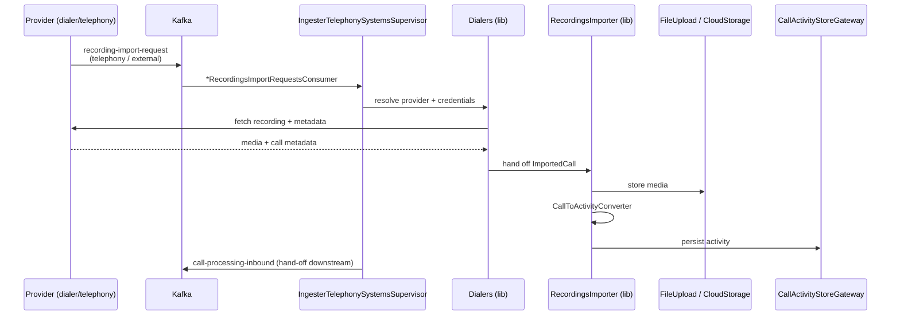
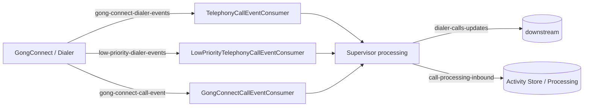
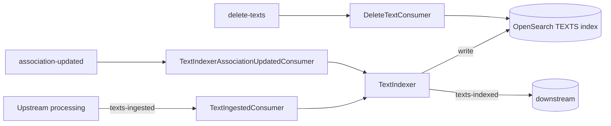
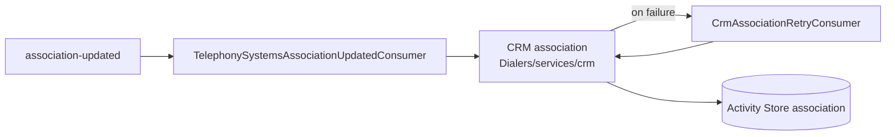

# 02 · Data Flows & Entry Points

> [[_dashboard|← Team Hub]] · [[01 - Architecture & Modules]] · next → [[03 - Services Reference]]

This is the most important page for understanding the system. It lists **every way data
or a request can enter Telephony Systems**, then shows the major flows as diagrams.

---

## 🔑 All system entry points

Telephony Systems has **four classes of entry point**. Anything that triggers work in our
services comes through one of these.

### 1. Kafka consumers (event-driven — the primary path)

| Consumer | Service | Topic(s) consumed | Triggers |
|---|---|---|---|
| `TelephonyRecordingsImportRequestsConsumer` | RecordingsImporter (in Supervisor) | `telephony-recordings-import-requests` | Import a recording for a telephony call |
| `ExternalRecordingsImportRequestsConsumer` | RecordingsImporter (in Supervisor) | `external-recordings-import-requests` | Import a recording from an external source |
| `TelephonyCallEventConsumer` | Supervisor | `gong-connect-dialer-events` | A dialer call event to ingest |
| `LowPriorityTelephonyCallEventConsumer` | Supervisor | `low-priority-dialer-events` | Low-priority dialer call event |
| `GongConnectCallEventConsumer` | Supervisor | `gong-connect-call-event` | Call event from Gong's own calling product |
| `TelephonySystemsAssociationUpdatedConsumer` | Supervisor | `association-updated` | CRM association changed → re-associate call |
| `CrmAssociationRetryConsumer` | Supervisor | (retry topic) | Retry a failed CRM association |
| `CompanyUpdatedConsumer` | Supervisor | company-updated | Company/account metadata changed |
| `MsTeamsAppUserChangesConsumer` | Supervisor | `app-user-changes` | MS Teams user added/removed/changed |
| `TsNonRecordedCallsProcessingStatusConsumer` | Supervisor | `call-processing-status-event` | Processing-status feedback for non-recorded calls |
| `TextIngestedConsumer` | TextIndexer | `texts-ingested` | New call text to index |
| `TextIndexerAssociationUpdatedConsumer` | TextIndexer | `association-updated` | Re-index on association change |
| `DeleteTextConsumer` | TextIndexer | `delete-texts` | Delete indexed text |

> **Producers** (where we emit events): `DialerCallsUpdatesProducer` (`dialer-calls-updates`),
> `WebConfCallsUpdatesProducer` (`webconference-call-events`), `CompanyUpdatedProducer`,
> `GdmCallEventSender`, the RecordingsImporter `ImportEventsKafkaConfig`, and the Supervisor's
> writes to `call-processing-inbound` / `call-processing-inbound-low-priority` (the downstream
> hand-off) and `texts-ingested`. TextIndexer emits `texts-indexed` / `texts-deleted`.

### 2. REST / HTTP endpoints

**52 controllers** across the services. Spring Boot `main` entry points:

| Service | Main class |
|---|---|
| TelephonySystemsWebApi | `com.honeyfy.telephonysystemswebapi.TelephonySystemsWebApi` |
| IngesterTelephonySystemsSupervisor | `…ingestertelephonysystems.init.IngesterTelephonySystemsSupervisorInitializer` |
| TelephonySystemsTroubleshooters | `…TelephonySystemsTroubleshooters.init.TelephonySystemsTroubleshootersInitializer` |
| TextIndexer | `…elasticsearch.indexer.text.init.TextIndexerInitializer` |

Notable **public / functional** controllers (TelephonySystemsWebApi, served under `/telephonysystemswebapi`):

- `TelephonyIntegrationController` — configure a telephony integration
- `TelephonyOAuthController` — OAuth start/callback for provider auth
- `TestController` — health/test

Notable **ingestion** controllers (Supervisor):

- `UploadedCallEventController`, `PbxRecordingImportController` — direct call/recording upload
- `DialpadController`, `SmsController`, `MsTeamsOnGoingCallsController`, `OutreachSignerController` — provider webhooks/callbacks
- `IntegrationsController`, `SyncSchedulingController`, `SyncPropertiesController` — integration & sync management
- `GongConnectController`, `ActivitiesController`, `CRMInfoRetrievalController` — call/activity/CRM data

> **Troubleshooter** controllers (the `*Troubleshooter` classes, ~25 of them) are a
> *protected* entry point — VPN + `troubleshootersAuthJWT` cookie. See
> [[06 - Runbook & Troubleshooting]] and [[Architecture/Troubleshoot Endpoints]].

### 3. Scheduled / distributed tasks (time-driven)

Run by `IngesterTelephonySystemsSupervisor` (`scheduledTasks: true`) via a
`DistributedScheduledTaskExecutor` (config: `config/ScheduledTasks.java`, task package:
`tasks/`). These periodically **pull** from providers and do housekeeping:

- Provider **sync jobs** (`services/syncjob/SyncJobExecutionService`) — poll dialers for new calls
- `SimpleHeartbeatTask` — liveness/heartbeat
- `S3OldEventMetaDataCleaner` / `OldMetaDataCleaner` — data lifecycle cleanup

`TextIndexer` also declares `scheduledTasks: true` for index-maintenance work.

### 4. Cloud storage / S3 event ingestion (object-driven)

Some providers drop recordings into S3; an S3 event then drives ingestion:

- `Dialers/.../importcalls/S3EventsDao(+Impl)` — record/lookup S3 events
- `Dialers/.../generic/AbstractS3EventsDialerService` — generic S3-event-driven dialer
- Supervisor `services/S3EventHandler` + `rest/S3DataController` / `S3EventsTroubleshooter`

---

## Flow A — Recording ingestion (the core path)

## Flow B — Dialer call events (metadata-first)

## Flow C — Text indexing

## Flow D — CRM association

## Kafka topic map (who reads / writes what)

| Topic | Supervisor | Troubleshooters | TextIndexer | WebApi |
|---|---|---|---|---|
| `telephony-recordings-import-requests` | R/W | | | |
| `external-recordings-import-requests` | R/W | | | |
| `gong-connect-dialer-events` | R | | | |
| `low-priority-dialer-events` | R | | | |
| `gong-connect-call-event` | R | | | |
| `gong-connect-call-ingested` | R/W | W | | |
| `call-processing-inbound` (+ low-priority) | W | | | |
| `call-processing-status-event` | R | | | |
| `association-updated` | R | | R | |
| `app-user-changes` | R | | | |
| `texts-ingested` | W | | R | |
| `texts-indexed` / `texts-deleted` | | | W | |
| `delete-texts` | | | R | |
| `dialer-calls-updates` | | W | | |
| `webconference-call-events` | | W | | |
| `comment-update` | | W | | |
| `telephony-troubleshooting` | R/W | | | |
| (`APP_USER` cluster) | | | | W |

> Access (R/W) is taken from each module's `*.gong-app-descriptor.yaml`. Treat this table as
> the authoritative starting point, but confirm against the descriptor before relying on it
> for a change — topics are added/removed over time.
