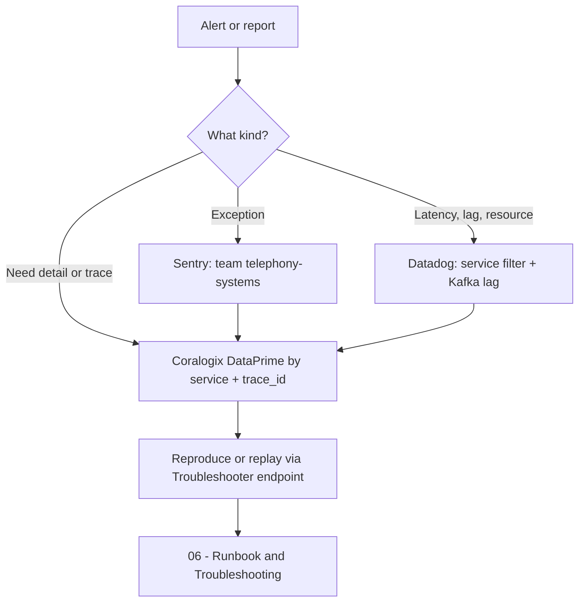

# 05 · Observability

> [[_dashboard|← Team Hub]] · [[04 - Providers & Dialers]] · next → [[06 - Runbook & Troubleshooting]]

> ⚠️ **Honesty note:** Gong's observability tooling is accessed through MCP integrations and
> region-specific apps. The **link patterns and query filters below are correct**, but where a
> URL needs a specific dashboard/alert ID I've left a `<…>` placeholder rather than invent one.
> Paste the real IDs in the first time you open each — then this becomes a true one-click hub.

## Service identifiers (use these everywhere)

Filter by the container-image names — these are the service identifiers in logs/metrics:

| Service | `service` / image name |
|---|---|
| TelephonySystemsWebApi | `telephonysystemswebapi` |
| IngesterTelephonySystemsSupervisor | `ingestertelephonysystemssupervisor` |
| TelephonySystemsTroubleshooters | `telephonysystemstroubleshooters` |
| TextIndexer | `textindexer` |

---

## 📜 Logs — Coralogix

Gong uses **Coralogix** for logs/traces (multi-region: `coralogix-us-01`, `us-02`, `eu-02`, `np`).
Query in **DataPrime**.

**Starter query — errors for a service (last 1h):**
```text
source logs
| filter $l.applicationName == 'ingestertelephonysystemssupervisor'
| filter $m.severity == 'ERROR'
| limit 200
```

**Follow one call/trace:** filter by `trace_id` or the call/activity id in the MDC, then
correlate logs ↔ spans.

- Ask Claude: *"use the coralogix-debug-expert"* for guided investigations, or run a
  DataPrime query via the `observability:coralogix-logs` skill.
- Per-logger level changes at runtime: **Logs Manager** troubleshooter — see
  [[Engineering/Swagger Pages|Swagger Pages]] (`logs-manager-vip.prod.gongio.net`).
- https://gong-prod-gpe-us-01-1.app.coralogix.us/#/query-new/archive-logs?id=BtrbnEFENLTqT7DRjpgNM&time=from:now-5m,to:now&page=0&permalink=true

---

## 📈 Metrics — Datadog

Gong publishes metrics to **Datadog** (no APM/traces — traces are in Coralogix).

**Useful metric families** (filter by `service:<name>` and `g-cell`):

| Metric family | What it tells you |
|---|---|
| `com.honeyfy.*` | App/business metrics (import counts, provider sync, failures) |
| `feign.*` | Outbound calls to upstream services (ProviderIntegrationManager, FileUpload…) |
| `jvm.*` | Heap, GC, threads |
| `kubernetes.*` | Pods, restarts, CPU/mem, HPA scaling |
| Kafka consumer lag | Backlog on our consumers (the #1 ingestion-health signal) |

- Ask Claude: *"use the datadog-expert"* or the `observability:datadog` skill.
- **Dashboard:** `https://app.datadoghq.com/dashboard/<dashboard-id>` — *paste team dashboard id*
- **Kafka lag** is the key health metric — alert if consumer lag on
  `*-recordings-import-requests` / `gong-connect-dialer-events` grows unbounded.
- https://app.datadoghq.com/dashboard/ptx-4jk-fkr/telephony-systems-dashboard?fromUser=false&refresh_mode=sliding&from_ts=1781874089146&to_ts=1781877689146&live=true
- 

---

## 🚨 Alerts

### Sentry (errors / exceptions)

- **Team:** `telephony-systems` (set as `sentryTeam` in every service descriptor).
- Org: `https://gong-io.sentry.io/` → filter by team `telephony-systems`.
- Investigate an issue: ask Claude *"investigate this Sentry issue <url>"* → runs the
  `observability:sentry-investigation` workflow (Sentry → Coralogix correlation → code).
- ⚠️ `TextIndexer` reports to **`deal-intelligence`**, not `telephony-systems`.

### Datadog monitors

- Monitors: `https://app.datadoghq.com/monitors/manage?q=service%3A<service-name>`
- Recommended coverage (verify what already exists): consumer-lag, error-rate,
  pod-restart/crashloop, provider-sync-failure rate.
- https://gong-io.sentry.io/issues/?query=assigned%3A%23telephony-systems&referrer=issue-list&statsPeriod=14d

---

## 🔭 Quick triage flow



## TODO for the team (fill these in once)

- [ ] Paste real **Datadog dashboard** URL(s) for the 4 services
- [ ] Paste **Sentry** saved-search URL for `telephony-systems`
- [ ] List the **named Datadog monitors** that currently exist + their thresholds
- [ ] Confirm which **Coralogix region** our cells log to
