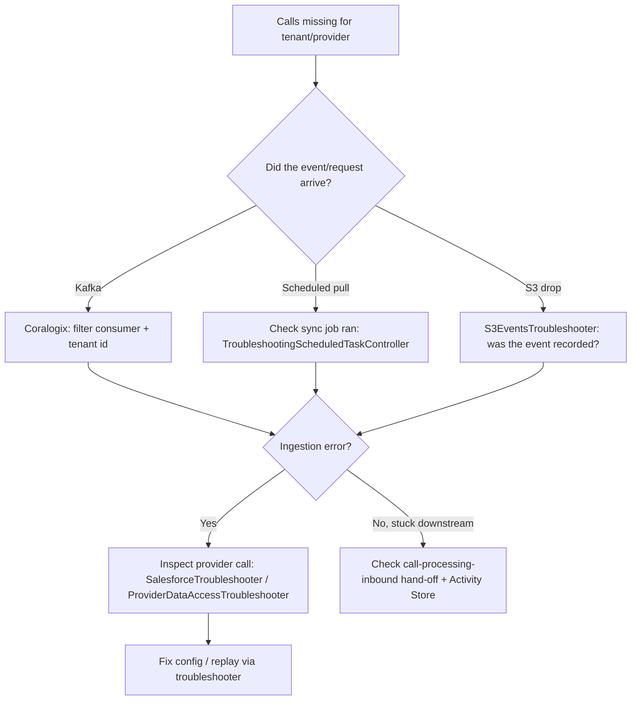

# 06 · Runbook & Troubleshooting

> [[_dashboard|← Team Hub]] · [[05 - Observability]] · next → [[07 - Onboarding Checklist]]

## Troubleshooter endpoints

`TelephonySystemsTroubleshooters` and the `*Troubleshooter` controllers in the Supervisor
are **internal, production-active** REST endpoints for support/engineering to inspect and
re-drive ingestion. They are **not** tenant-facing.

**Auth (two layers):**
1. **Network** — support-team VPN ingress (`*.prod.gongio.net` is not internet-exposed).
2. **Application** — Okta-issued JWT in the `troubleshootersAuthJWT` cookie, validated by a
   filter on the `/troubleshooting/**` path group.

Full pattern + rules: [[Architecture/Troubleshoot Endpoints]]. Swagger discovery:
[[Engineering/Swagger Pages]].

### Notable troubleshooters (Supervisor `rest/` package)

| Troubleshooter | Use for |
|---|---|
| `SalesforceTroubleshooter` | Inspect/replay Salesforce-dialer ingestion |
| `S3Troubleshooter` / `S3EventsTroubleshooter` | Inspect S3-drop events & re-drive |
| `SftpTroubleshooter` / `SshPublicKeyTroubleshooter` | FTP-dialer connectivity & keys |
| `TelephonyCallEventsTroubleshooter` | Inspect dialer call events |
| `CRMInfoRetrievalTroubleshooter` | CRM lookup debugging |
| `IntegrationsTroubleshooter` / `TelephonyIntegrationFrontTroubleshooter` | Integration config state |
| `SmsTroubleshooter` / `TelephonySystemsSmsTroubleshooter` | SMS flows |
| `TroubleshootingScheduledTaskController` | Inspect/trigger scheduled tasks |
| `MSTeamsNumonixTroubleshooter` | MS Teams / Numonix recording settings |
| `ProviderDataAccessTroubleshooter` | Raw provider-data access |
| `CallActivityStoreIngesterTroubleshooter` | Activity-store hand-off |
| `RecordingsImporterTroubleshooter` (RecordingsImporter) | Recording import replay |
| `TextIndexerTroubleshooter` (TextIndexer) | Re-index / inspect text |

> Discover the live, exact paths via each service's Swagger UI at
> `https://<service>-vip.prod.gongio.net/swagger-ui/index.html` (VPN + cookie).

---

## Local / hybrid health check (Supervisor — port 8097)

When the Supervisor is running locally or via `gong-module-run`, it listens on `localhost:8097`.

```bash
# Is it up?
curl -s http://localhost:8097/actuator/health | jq .

# Is it ready to serve traffic?
curl -s http://localhost:8097/actuator/health/readiness | jq .

# Build info / version
curl -s http://localhost:8097/actuator/info | jq .

# All exposed actuator endpoints
curl -s http://localhost:8097/actuator | jq .
```

Expected: `{"status":"UP"}` from the health endpoint.

---

## Common incident playbooks

### 1. "Calls from provider X aren't showing up"



### 2. Consumer lag climbing

1. Datadog → Kafka consumer lag for the service ([[05 - Observability]]).
2. Coralogix → are records erroring or just slow? Filter by consumer class.
3. Check upstream Feign deps (`feign.*` metrics) — FileUpload / ProviderIntegrationManager slow?
4. If poison message: identify offset in logs, decide skip vs. fix-and-replay.

### 3. CRM association failures

- `TelephonySystemsAssociationUpdatedConsumer` → `CrmAssociationRetryConsumer` already retries.
- Persistent failures: `CRMInfoRetrievalTroubleshooter`; check `CRM_FIELDS` / `INTEGRATION` data.

### 4. Recording import failing

- `RecordingsImporterTroubleshooter` to replay a single import.
- Check media access (customer S3 assumed-role: `CustomerS3AssumedRoleAccessor`) and
  **external CMK** access (these services have `externalCmkAccessNeeded: true`).

---

## Operational facts to keep handy

- **Deploy:** GPE, Crossplane-managed rolling deploys (`AwsAutoDiscoveryRollingDeployment`).
- **Locks:** Supervisor, Troubleshooters, TextIndexer use distributed locks (`locks: true`).
- **Runtime log levels:** adjustable via Logs Manager (no redeploy) — [[Engineering/Swagger Pages]].
- **Owners:** Supervisor/Troubleshooters → yossi.rizgan@gong.io · WebApi → adi.magen@gong.io ·
  TextIndexer → dor.shemer@gong.io (deal-intelligence).
- **New ticket:** use the repo's `create-telephony-ticket` skill (GONG project, pre-filled).


