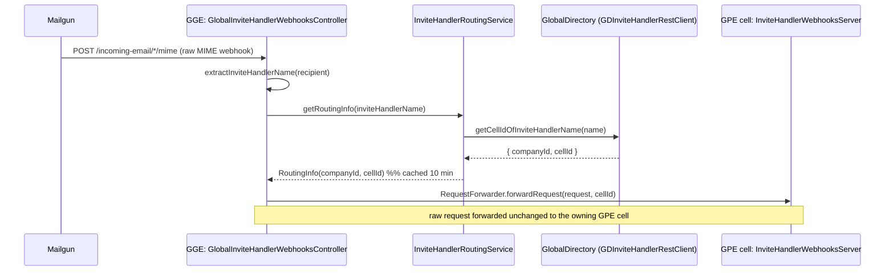

# Gong Environment Abbreviations (GGE, GPE)

> [!note] Source of truth
> The canonical definitions live in the **`ProductionEnvironmentType`** enum:
> `gong-infra-core` → `SharedEntities/src/main/java/com/honeyfy/util/config/ProductionEnvironmentType.java`.
> Every definition below is quoted from that enum's `description` field. When a doc or comment
> disagrees with the enum, the enum wins — fix the doc or the comment.

## TL;DR

- **GPE — Gong Production Environment**: a Gong environment that serves a *set of Gong customers*. These are the per-region / per-customer-group production **cells** where the product actually runs.
- **GGE — Gong Global Environment**: a *single, global* environment that provides global services (e.g. **GlobalDirectory**) to **all** GPEs.
- Traffic that arrives globally (e.g. Mailgun calendar-invite webhooks) lands in **GGE**, which looks up the owning customer's cell and **forwards the raw request to the correct GPE cell**.

---

## Definitions

### GPE — Gong Production Environment
> *"Gong environment that serves a set of Gong customers"* — `ProductionEnvironmentType.GPE`

A production **cell**. Gong runs many GPEs (per region / customer group), each identified by a
`cellId` (e.g. `gpe-us-01-1`, `gpe-us-02-1`). A GPE holds the customer's data and runs the full
product stack for the companies assigned to it.

### GGE — Gong Global Environment
> *"A single, Global environment that provides global services, like GlobalDirectory, to all GPEs"* — `ProductionEnvironmentType.GGE`

The **one** global cell. It hosts cross-cell / global-only services and acts as the global entry
point for traffic that isn't tied to a single customer cell yet. Some services exist **only** in GGE
(e.g. GlobalDirectory, Credentials Manager). GGE's job is to resolve *which* GPE owns a request and
route to it — it does not hold customer product data itself.

> [!warning] Naming variant in the wild
> The authoritative enum spells GGE **"Gong Global Environment"**. Some code comments and the
> root-level [[Acronyms]] glossary say **"Global Gong Environment"** — same thing, different word
> order. Prefer the enum's wording.

---

## Related terms

| Term | Meaning | Where it shows up |
|------|---------|-------------------|
| **Cell** | A deployment unit / isolated environment instance. Every GPE is a cell; GGE is the single global cell. | `global_directory.cell` table; `CellInfo.CellStatus` enum (`gong-clients`) |
| **`cellId`** | String identifier of a target cell (e.g. `gpe-us-01-1`). Used to route/forward requests. | `RoutingInfo.cellId()` |
| **GlobalDirectory (GD)** | Global-only service in GGE that maps global identities (companies, invite handlers) to their owning GPE cell. | `GDInviteHandlerRestClient`, `com.honeyfy.globaldirectory*` |
| **`GPEProperty`** | Enum of per-environment config properties, typed by `ProductionEnvironmentType`. | `gong-infra-core` `com.honeyfy.util.config.GPEProperty` |
| **Legacy vs non-legacy GPE** | GPE cells are further split into legacy / non-legacy for config purposes. | `TestGPEProperties/test_gpe_properties_gpe_{legacy,non_legacy}_cell.yaml` |

---

## GGE → GPE routing flow (global invite webhooks)

The clearest concrete example of the GGE↔GPE relationship is the **global invite-handler webhook**
path in [[00 - Overview|gong-call-schedulers]]. Mailgun delivers a calendar-invite email as a webhook
to a **single global URL** in GGE; GGE must figure out which customer/cell it belongs to and hand it
off to that GPE.

**Entry point:** `GlobalInviteHandlerWebhooksController` (`gong-call-schedulers` →
`GlobalInviteHandlerWebhooksServer`), running in **GGE**.

**Step by step:**

1. **Receive** — Mailgun POSTs the raw MIME webhook to the global endpoint in GGE
   (`/incoming-email/*/mime`, `/troubleshooting/incoming-email/**`).
2. **Extract** — `extractInviteHandlerName(recipient)` pulls the invite-handler name from the
   recipient address (`assistant123@calendar.gong.io` → `assistant123`).
3. **Resolve** — `InviteHandlerRoutingService.getRoutingInfo(name)` calls **GlobalDirectory**
   (`GDInviteHandlerRestClient.getCellIdOfInviteHandlerName`) to get `{ companyId, cellId }`.
   Results are cached for **10 minutes** (Guava `LoadingCache`); negative lookups are **not** cached.
4. **Forward** — `RequestForwarder.forwardRequest(request, cellId)` forwards the **raw** request to
   the resolved **GPE** cell's `InviteHandlerWebhooksServer`, which does the real per-tenant
   processing.

> [!info] Why this shape
> GGE is the only place that knows the global identity → cell mapping (via GlobalDirectory), so
> global-inbound traffic must land in GGE first. GGE stays thin: resolve the cell, forward raw,
> let the owning **GPE** do the customer-specific work. The same pattern appears for global Zoom
> webhooks (`GlobalZoomWebhookController` + `RequestForwarder` in `gong-cloud-recorders`).

---

## Source references

| What | Repo | Path |
|------|------|------|
| `ProductionEnvironmentType` (GGE/GPE definitions) | `gong-infra-core` | `SharedEntities/.../com/honeyfy/util/config/ProductionEnvironmentType.java` |
| `GPEProperty` | `gong-infra-core` | `SharedEntities/.../com/honeyfy/util/config/GPEProperty.java` |
| `GlobalInviteHandlerWebhooksController` | `gong-call-schedulers` | `GlobalInviteHandlerWebhooksServer/.../controllers/GlobalInviteHandlerWebhooksController.java` |
| `InviteHandlerRoutingService` | `gong-call-schedulers` | `GlobalInviteHandlerWebhooksServer/.../service/InviteHandlerRoutingService.java` |
| `CellInfo.CellStatus` | `gong-clients` | `com.honeyfy.backend.clients.globaldirectory.gdcell.dto.CellInfo` |

---

## See also

- [[Acronyms]] — vault-wide glossary (the one-line GGE entry; **update it to match the enum**)
- [[00 - Overview]] — Call Scheduling subsystem overview
- [[02 - Entry Points (Inbound & Outbound)]] — where the webhook entry points live
- [[03 - Ubiquitous Language]] — Call Scheduling domain glossary
